# 計算コード選択の基礎知識

!!! Note
    2015.11頃に初心者向けの第一元計算入門をCMSIから依頼されて執筆した文章です。最終的にはCMSIには投稿しておりません。実は、最終版の登校前に都合、身分の都合ドタキャンせざるを得なかった曰く付きの文章でもあります。原稿を見ていただいた先生を初め、当時の関係各者にご迷惑をおかけしました。まだ何処にも公開していないので、プライベートなページなので、 せっかくなので書庫から引っ張りして、MD化した ので公開致します。

## 目次

[TOC]


## はじめに

Akai-KKR,OpenMX,xTAPP,ABINIT などCMSIのMateriAppでは、様々な第一原理計算コードが
紹介されています。初めて計算を行う人などは、これら計算コードの違いがわからず戸惑
うことが多いと思います。

これら計算コードの違いを深く学ぶのは、本来大変な時間がかかるものですが、いくつか
のポイントを抑えれば計算コードの違いをそれなりに適切に理解することは、計算物理の
専門家でなくても容易です。このドキュメントは、計算物理を専門としてない方が計算
コードやその手法の違いを大雑把に理解していただけるようにするためのものを目指して
おります。実験屋や企業の研究者の方に活用していただけたらと思います。

このドキュメントの内容は2015年7月28日に行われた「SPring-8 材料構造の解析に役立つ
計算科学研究会(第1回)」における講演の一部をほぼ文章化したものです。元のプレゼン
資料の公開版は、SPring-8 の
[Webページ](http://www.spring8.or.jp/ext/ja/iuss/htm/text/15file/computational\_science/1st/index.html)
 にて紹介されております。
(リンク切れの時は[こちら(SP8サイト内のみ)](http://daruma.spring8.or.jp/daruma/abinit/pdf/5.nakada.pdf))

専門の方から見ると話が大雑把すぎたり、わりといい加減なことを言っているかもしれ
ません。実際、筆者自身はFLAPW法が専門であり、主流とはいささか離れたところにいる
ため、かなり偏った知識であり、しかもコード開発等の現役から一線を退いて長く、そし
ておそらくわりと独断と偏見が混ざっています。当然、私自身の知識不足も当然として、
伝える能力の不足もあります。専門家の方は専門的な書籍を読んでいてだけたらと思いま
す。なによりも元々は２０分のプレゼン資料がベースですので、わりと大雑把でざっくば
らんに話を進めておりまして、そもそものターゲットは初学者を想定しています。
その点はご了承ください。

残念ながら万能な計算方法（計算コード）はありません。少しでも多くの人がそれぞれの
計算コードの特徴を捉えて、それぞれの問題解決に向けて使い分けることが出来るように
なれれば、その手助けになればとは思います。


## DFTに基づく第一原理計算手法はKS方程式(一種のシュレディンガー方程式)を解いている

密度汎関数理論(DFT)に基づく第一原理計算はどのような方程式を解いて計算しているの
か？という問に対して端的に答えるには、KS(コーンシャム)方程式を解いていると答える
ことが出来ると思います。


この方程式自身は「ある有効ポテンシャル中の一電子のシュレディンガー方程式を解いている」
という理解でもほとんど問題ありません。そして計算コードの違いはこの方程式の解き方
の違いになります。世界の計算コードが非常に多様性に富んでいるのは、KS方程式を構成
している各要素にどのような近似を適応して、それをどのように解くか？が異なるからです。
それぞれ得意分野や不得意分野が有ります。本格的に各コードを整理する前に、簡単に
各構成要素について説明したいと思います。
これらの各要素はDFT-KS方程式を超えた近似方法[^1]を採用する場合においても、基本的
に重要な要素となりますので、以下の要素を抑えておくことは重要となります。

[^1]: たとえばXANESスペクトルの計算では、core-hole の相互作用をより正しく取り組 むためには一電子近似されたDFT-KS方程式を解くのではなく、BSE方程式などの二粒子の 電子相関を露わにとり組んだ方程式を解くなどのアプローチが必要な場合があります。

### (1) 計算コードの違いに直結する４つの要素

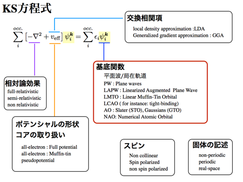

扱う原子が重くなると相対論効果が無視できなくなります。
近似の範囲がいくつかありますが、たいていの第一原理計算ではスピン軌道相互作用を
除いた相対論効果である Scalar relativistic (Semi relativistic) が適応されています。
Scalar relativistic は原子番号が30を超えたら少なくとも必須となるのは覚えておいて
損はないかと思います。
また、原子番号が２０を超えると注意が必要です。
軽元素を扱うことが多い量子化学系のDFT計算コードではあえて最初からScalar relativistic
レベルの相対論効果も入れずに、非相対論で解くことがデフォルトの場合がありますので、
それらのコードで3d遷移金属を扱うときには、注意が必要となります。
また、スピン軌道相互作用を含めた相対論効果は希土類元素なども含めた重い元素名で
重要な働きをするのはご存知のとおりなのですが、第一原理計算ではスピン軌道の導入に
あたっていくつかの流派（近似）がわかれます。
一般に Salar relativistc + スピン軌道相互作用を合わせて full-relativisitc と言い
ますが、実用的な計算速度で、それなりの近似の範囲で、かつfull-potentialな計算が
可能であることから、現在の主流は**第二変分法[^2]**と呼ばれる方法で
「Scalar relativistic + スピン軌道」で導入されることがほとんどです。
無論、より優れた近似でこれら相対論効果を取り入れている計算コードも有ります
(大抵は計算が重くなります）。
これらスピン軌道を含めた相対論効果の第一原理計算での扱いは、ここでは詳しく述べる
ことはしませんが、スピン軌道相互作用が重要な（その物性に本質的な）場合は、
注意が必要となります。

[^2]: 摂動論的方法と勘違いしている人もいますが、摂動ではありません。


### (2) ポテンシャルの形状およびコアの取り扱い

KS方程式を解く際のポテンシャルの形状の近似の範囲を示します。
ポテンシャルの形状の近似に関しては、**MT(Muffi-Tin)近似と呼ばれる球対称近似**
であるのか、ポテンシャルの形状に依存しない Full-potential といわれる方法を用いる
かの大きく２つの方法論が有ります。
当然、MT近似よりはFull-potentialの方が良い近似なのですが、たとえば**金属で充填率
が高い系などはMT近似はよく成り立ち**、とても**高速(かつ低消費メモリ)**に問題を
解くことが可能ですので一概に悪い近似と断じることは出来ません。
無論、今どきの主流の計算コードは意識せずとも Full-potential な計算コードが多いの
ですが、先に述べた相対論効果の近似の取り扱い方法や、後で述べる基底関数の問題とも
合わせてMT近似の範囲で問題を解かざるを得ない計算手法も現在でも多くあります[^3]。
そして解くべき物質系によってはMT近似で十分なことも多いのは覚えておくべきです。
それぞれ一長一短ですので注意が必要です。
のちほどまとめたいとは思います。
無論、表面の計算や分子などの計算ではMT近似はあまり良い近似ではありませんので注意
が必要です、そのような系では、なるべくFull-potentialな計算手法を用いましょう[^4]。
また、第一原理計算コードのメインストリームである擬ポテンシャル法に基づく計算コード
は、ポテンシャルの形状としてはFull-potentialとなります。
その代わり、擬ポテンシャル法では、コアの取り扱いとして内殻の電子状態の計算はでき
ないので注意が必要となります。

[^3]: 相対論効果の取り扱いにおいて、Dirac方程式を**4-componet**で解いているコード や、LMTO法,KKR法などの多くは基本的にはMT近似であると認識したほうが良いです。 無論、例外もあります。

[^4]: たとえば、XAFSのスペクトルを測定される方は殆どの人が(特に日本国内では) Altermis と呼ばれる解析ツールを用いると思いますが、このAltemis では内部的には FEFFと呼ばれる計算コードを用いています。実は FEFFはMT近似の範囲で(KKR-Green関数法で) 電子状態計算を行っています。そのため非常に高速に問題が解けますが、EXAFSの解析では 全く問題はありませんが、この近似の範囲内では、分子や表面などのXANESの計算は答えが 合わないことが多いので注意が必要です。


### (3) 固体の記述

後に述べる基底関数の選択にも強く依存していますが、大雑把には、周期的な単位胞で
計算するのか、孤立した分子や原子などの状態として計算するのか方法論にわかれます。
実空間法で計算する方法論も有りますが、一般に流通する第一原理計算コードの中では
かなりマイノリティーですのでここでは割愛いたします。後のセクションで基底関数の
選択の議論とともにもう少し詳しく説明いたします。

### (4) 基底関数の選択

ほとんどの第一原理計算コードではKS方程式は基底関数展開法を用いて解いています。
計算コードによっては、空間をメッシュに分割した実空間での差分法定式(FDM)として、
KS方程式を二階の偏微分方程式として解いている手法も有ります。
ただ、これはかなりマイナーです[^5]。
ほとんどの問題は波動関数は基底関数で展開され、解かれます。それゆえにKS方程式の
それぞれの要素は基底関数の選び方と密接に関係があります。当然ですが基底関数に
よって展開されるのは波動関数だけではなく、電子密度やポテンシャルもその基底関数で
展開されます。
そのため、殆どの場合、基底関数の特徴を抑えれば、それぞれの計算コードの特徴を
抑えることが可能になります。次のセクションでもう少し詳しく説明いたします。

[^5]: もともとは流体などのマクロなスケールで用いられてきた手法ですが、最近では RSPACE などのコードで第一原理計算としても適応されています。周期境界条件に縛られず、クラスターモデルから周期境界条件まで幅広く計算可能です。他のFDMコードでは、例えば、FDMNESなどのコードではXANESスペクトルの計算からEXAFSまで幅広く計算できます。

```math
式
```

## 基底関数の選択

基底関数の選択には大きく２つの考え方があります。ひとつは局在基底(Local basis)を
用いる考え方。もう一つは平面波基底(Planewave basis)を用いる考え方です。

### (1) 局在基底

原子・分子などの問題を解く場合には、原子に局在する関数を用いて記述するほうがより
適切にその一電子状態が表現できます。これには多くの場合、原子基底関数(Atomic Orbital)
やその線形結合(LCAO)を用いた基底関数が選ばれます。たとえば Gaussian などの計算コードで
は原子基底関数として STO(Slater Type Orbital)やGTO(Gaussian Type Orbital)を用いて
KS方程式が解かれるために、原子分子の電子状態の記述が極めて容易になります。

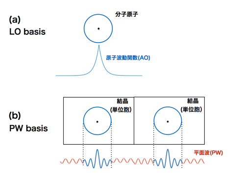

この基底を選ぶことによるメリットはいろいろ有りますが、基底の数が平面波を選ぶ場合と
比べて非常に小さいことは実用上、特に大きな意味を持ちます。つまり計算が圧倒的に軽い
（速い）のです。メモリ消費も少ないです。また、原子に局在している波動関数をスタート
としているためにモデル的な物理描像に近く、これらの描像に基づく解析・理解と非常に
親和性が高いです。それにより、たとえば結合状態に関しての多くの解析が容易に可能と
なるなど解析上さまざまなメリットも有ります。無論欠点も数多くあります。STOやGTOなど
の多くの基底系ではその基底関数は完全系を張りません[^6]。
STOやGTOの重ね合わせだけでは
完全にその系の一電子状態を記述することは出来ないのです。不完全さが残ります。
このため局在基底でかつ不完全な基底セットを用いるために原子に働く力を求める際に
Pulay補正と呼ばれる項が出てきます。そのため原子に働く力の計算が苦手であるなど、
特に分子動力学計算が一般的な平面は基底と比べるとかなり苦手です。また、局在する
波動関数同士の重なり補正(BSSE補正)を考慮する必要があるなど、計算上の困難さも
有ります。この問題も同じく分子動力学計算が苦手な理由にもなります。さらに、d軌道
を含むような系では単純な基底セットでは表現しきれ無いことが多く、自らが取り組む
物質ごとに応じて適切な基底セットを選んでいく必要があり、多くの場合経験を必要と
します[^7]。
ほぼ同じ意味で計算の収束の難しさが発生することも有ります。逆に言うと、
十分な経験を積み、必要最低限の基底セットで自らが計算したい分子などの計算をする
場合はかなり高速にそれなりの計算が可能であるとも言えます。

[^6]: 局在基底でもたとえばwaveletなど完全系を張る基底は当然あります。

[^7]:  そもそもSTO/GTOの場合はd電子をうまく記述するのに無理がありますので難しいです。


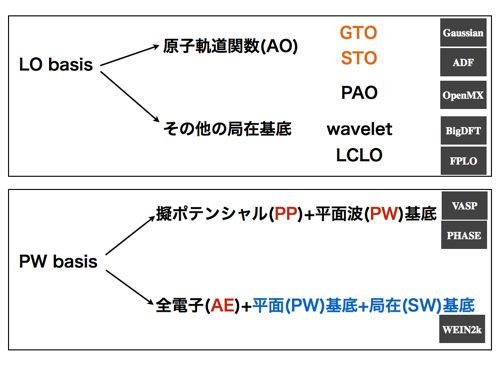

また、局在基底を用いる計算手法では内殻の電子状態を含めた計算、いわゆる全電子計算
を容易に行うことが出ます[^8]。そのため容易にX線吸収微細構造などの内殻励起のスペクトル
計算も可能というメリットが有ります。


[^8]:  無論、局在基底＋擬ポテンシャルと言った計算方法もありますので、局在基底だから内殻を常に計算しているわけではありません。例えば wevelet基底は内殻を記述するには荒すぎて普通は擬ポテンシャルと併用します。ただ、一般的にはSTOやGTO基底では普通は全電子計算です。これらの各計算コード毎の特徴については別途まとめます。

また、次のセクションで述べるような周期的な単位胞を持つような固体の計算も苦手
です。そもそもSTOやGTOの基底関数は単純には、結晶の一電子状態を記述するような
ブロッホ関数の形を作りません。ただし、同じように局在基底から派生していても、当然、
古くはセル法を初めとして、KKR法やLMTO法などのように最初からブロッホ関数の形を
とるように局在基底で展開する方法もあります。この場合は周期境界条件を持つ固体の
計算が得意になりますが、逆に分子系の計算が苦手になります。ここでは話の流れが複雑
になるのであまり詳しくは述べません。ここで言う局在基底系の話は、基本的には主に
量子化学計算で用いられているSTOやGTOベースのお話だと思ってください。


### (2) 平面波基底

固体などの周期境界条件を持つ物質の場合は結晶中の一電子状態はブロッホ関数の形を
取らなくてはなりません。このような物質系の場合は、Planewave(PW) basis を用いると
その記述は極めて容易になります。逆に言うと、平面波基底のコードで非周期の計算を
しようとしたらそのままで計算が出来ません。分子系の計算を行う場合には真空層を十分
にとったセルを用意するなどの工夫が必要なります。同じように、結晶のある一方向の
周期性が破れたようないわゆる表面における計算においても真空層を用意した周期スラブ
モデルを用いるなどの工夫が必要となります。さらに問題は、真空領域と仮定できるほど
の大きな単位胞を用意したら、実は平面波が全空間で広がるために、単位胞が大きくなれ
ばなるほど平面波の数が必要となり、計算コストが体積とともにうなぎのぼりに増えて
いくことです。一般には、平面波ベースでは真空領域にも平面波が必要となります。
その意味ではあまり分子や表面の計算は得意ではありません。つまり分子や表面などの
計算も可能ですが、大前提としては(特に)得意なのは周期的な境界条件を持った系に
有効な計算手法であることは覚えておいてください。

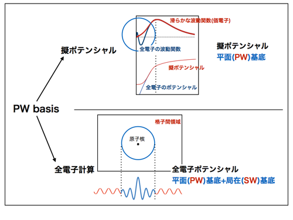

また、このセクションと矛盾するようですが、実は単純に平面波基底を用いただけでは
内殻状態を含めた結晶の計算は実は不可能であるという事実もまた同時に覚えておいて
ください。平面波だけで問題が解ければ誰も苦労しません。現実の結晶では内殻の電子状態
の変化が極めて大きくなります。局在基底であれば原子核近傍の激しい変化を持つ波動関数
がそのままの基底で低コストに記述可能ですが、平面波でそれら局所的な激しい変化の波
を記述しようとすると莫大な数の平面波が必要となってしまい現実的には収束は極めて
困難です。平面波基底で結晶の計算はそのままでは実は無理なのです。そのためには平面
波基底をスタートとして様々手法が考案されています。無論、平面波基底ベースとしては
基本的にはここで述べた性質は共通にもちます。次からは、歴史的な経緯や詳細は置いと
いて[^9]、ざっくばらんに現在主流といえる２つのアプローチについて大雑把な説明を
したいと思います。

[^9]:  本当は歴史的経緯・発展を追いかけたほうが理解がしやすいので、勉強するときは順に学んだほうが良いかと思います。最近ではR.M.マーチンなど優れた入門書が多数あります。

#### (2)-(A) 全電子計算手法

固体における電子状態の特徴は、原子と原子の間の領域（格子間領域：IT(Interstitial)
領域)が平面波で記述しやすい平坦な電子状態であり、逆に原子核近傍の領域は局在基底
で記述しやすい変化の激しい電子状態という２つの性質を同時に持つことに有ります。
そのため、原子核近傍においては局在基底を用い、格子間領域においては平面波を用いる
という、２つの異なる波動関数を結合させた波動関数を用いて記述する方法が考案され
現代に至ります[^10]。
局在基底は平面波の球面波展開という形で記述が可能であるため、
本質的には平面波基底ベースで、原子核近傍のみ平面波を補強するというアイデアで結晶
ポテンシャル、波動関数が記述されます。これがAPW/LAPW/FLAPWと呼ばれ発展していく
方法論です。大雑把には、平面波(PW)+球面波(SW)基底の結合した基底だと考えて頂いて
よいかと思います。現代では、WEIN2k や Exciting、FLEUR、HiLAPW、ABCAP、KANSAI な
どがこの方法を取り扱っています。特徴としては、真っ正直に固体の電子状態を記述して
いることです。

[^10]:  ここで述べる方法以外にも無論、固体等で適応可能な全電子計算手法はありますが、申し訳ありませんが、ここでは話の筋がややこしく(長く)なるので割愛しています。

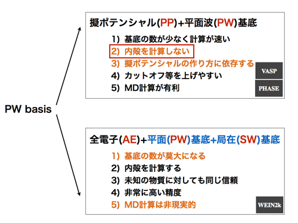

内殻の電子状態を毎回計算して結晶ポテンシャルを作るために、あらゆる未知の物質に
対して高精度で計算が可能です。原子の内殻状態から毎回計算しているので原子の情報
は原子番号のみ与えれば計算は可能です。当初はMT近似(球対称近似)での計算でしたが、
その後M.WeinertによってFull-potential法が開発されました。当然、現代ではほとんど
の計算手法はもれなく full-potential 計算でして、ポテンシャル形状に一切の仮定も
入っておりません。これらの全電子手法は万能のようですが、まず最大の問題は基底の
数が莫大になるために計算コストがやたらに高いという問題があります。平面波を補強し
ているためにオーバーコンプリートの問題も有り、局在基底にあるのと似たよう意味で、
原子に働く力の計算の困難性もあります。つまり、分子動力学計算にはまったくもって
向いていません。そもそも基底が莫大で計算コストが高すぎます。FLAPWは、線形化バンド
計算に関わる本質的な問題など細かく言えば問題は多くありますが[^11]、未知の物質に対する
アプローチ、信頼性の意味では、他のすべての計算手法の指標になっています。多くの
計算コードにとって「計算精度が良い」というのは殆どの場合WIEN2kなどのFLAPW法の
計算結果との誤差が少ないことを意味します。また、これらの手法は特に内殻の計算を
まともに行っているために、X線吸収微細構造の計算[^12]なども容易に行うことが出来、かなり
実験結果と良い一致を示します。また、本質的に周期境界条件に基づく平面波基底ベース
であるため、先のセクションで述べたように、分子や表面の計算では工夫が必要であり、
それらの計算は本来は得意ではないです。特に、FLAPW法は基底の数が莫大であるため、
真空領域にも等しく莫大な基底が必要なために、この手法で分子や表面の計算はクレイジーと
思えるほどの計算コストがかかります。正直これらの系ではオススメしにくいです。

[^11]:  たとえば代表的なものに浅い内殻を持つ原子の計算における、ゴーストバンドの問題などがあります。実はこれに関しては、Local Orbital の導入や内殻と直交化した動径関数をあらわに持ってくることによりゴーストバンドの問題はわりと解決されています。でも、未知物質の計算で問題にぶつかるときは大抵は線形化の問題で止まることが多いです。

[^12]:  計算結果が実験と合わないことの多くはcore-holeの相互作用の問題であったりなどFLAPW法自体の問題とは違う電子相関の問題であることが多いです。ただ、本質的に線形化バンド計算であるため、考えられているEF近傍のエナジーパラメータ近傍以外の結果は保証されず、XAFSのような非常に広範囲のエネルギー領域の計算は実は本質的には弱いです。それでも、XANESは割と結果は合います。

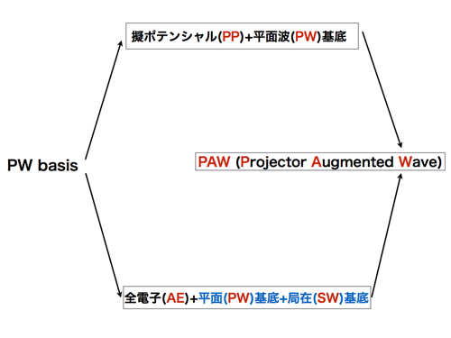


#### (2)-(B) 擬ポテンシャル法

全電子手法以外の平面波基底ベースの第一原理計算手法としては、擬ポテンシャル法が
あります。擬ポテンシャル法は、大きく言えば２つの基本方針から作られています。
ひとつは、内殻の問題は内殻の問題、価電子の問題は価電子の問題として、価電子の問題
のみ正しく解ければ良いという基本方針です。つまり内殻の電子状態はたとえば、TiO2 の
計算をする場合でも、TiNの計算を行う場合でも、Tiの内殻の電子状態はTiとして扱います。
これはフローズンコアと呼ばれる近似です。そして、もうひとつは真実の価電子を用いた
結果と同じ結果を与える人為的に作った擬ポテンシャルを用いる近似です。これにより、
適度な数の平面波で記述が可能な滑らかな擬ポテンシャルとそれに対応する擬波動関数の
問題として解くことが出来ます。擬ポテンシャルと擬波動関数で問題を解いていても、
適切な擬ポテンシャルさえ与えられれば、真実の価電子状態を用いた計算と同じ結果を
与えます。実際には、擬ポテンシャルはWIEN2kなどの全電子計算手法と同じ結果を与える
ように作られていますので、原理的には全電子計算手法と同様の精度の結果を得ることが
可能です。擬ポテンシャル法の最大のメリットは、十分に滑らかな擬ポテンシャルを用意
することにより、用いられる平面波の数（基底の数）を極めて少なくすることが出来ます。
全電子計算手法と比べて、計算が圧倒的に速いのです。そして、完全系を作る平面波基底
のもとで原子に働く力を容易に求めることが出来るために、分子動力学計算が高い精度と
高速な計算で実現可能となります。これは他の計算手法と比べてこれは大きなアドバン
テージになります。そして、全電子計算のように基底がゴージャスではないので、そも
そもの基底の平面波の数を増やす（カットオフを上げる）ことが容易にできるという
メリットも有ります。つまり、そもそもがゴージャスな基底のために基底の数を増やす
ことがなかなか出来ないFLAPWなどの全電子計算と異なり、カットオフをモリモリ上げ、
つまり変分の自由度を上げることが容易です。欠点としては、擬ポテンシャルの作り方に
結果が大きく依存してしまうことです。未知の物質に対してほんとうにそれが正しい
擬ポテンシャルであるかどうかの保証はありません。計算コード毎にそぞれの開発者が
作りこんでいる擬ポテンシャルの信頼度がある意味そのまま計算コードの信頼度に直結
すると言ってもいいかもしれません。また、当然ですが内殻の電子状態は毎回計算して
いませんのでX線吸収微細構造のような内殻からの励起スペクトルの計算もできません[^13]。
内殻も含めた真実の結晶ポテンシャル、真実の波動関数の情報を持っていないからです。
擬ポテンシャル法自身の基礎アイデアは歴史的にはOPW法[^14]から徐々に発展をし、第一原理
的に擬ポテンシャルを作るノルム保存擬ポテンシャル(NCPP)法や、さらに滑らかな
擬ポテンシャルを作るために、ノルム保存をする代わりに外から見た時の電荷の保存を
保証したUSPP法など大きく発展をしていきますが、本質的な性質は先に述べたことと
同じです。それぞれの擬ポテンシャル法の性質や各種法の詳細についてはここでは割愛
させていただきます[^15]。

[^13]:  次のセクション(2-C)で述べるPAWという方法により擬ポテンシャルベースでも内殻の計算が可能となります。

[^14]:  擬ポテンシャル法の勉強するのならばOPW法から学ぶとわかりやすいかと思います。

[^15]:  擬ポテンシャルを用いた計算コードはNCPPとUSPPそしてPAW法の３つは現在でも並列して存在していますので、本来ならば違いを理解したほうがよいとは思います。

#### (2)-(C) PAW法

擬ポテンシャル法では、平面波基底の元で、少ない基底関数でかなりの高精度の計算が
実現されました。しかし、比較的原子に局在している磁性に関わるd軌道の記述や、高圧化
における内殻電子状態が価電子化するなどの問題、浅い内殻電子状態の正しい記述が難しい[^16]
などの、内殻に近い電子物性の記述が難しい問題があります。

[^16]:  ウルトラソフトでは補正項があります。

それら内殻の電子状態 が重要な問題を解決する法方法として、全電子手法で計算されて
いるような内殻の電子状態の計算手法を、擬ポテンシャル法に導入する方法が考案されました。
それがPAW (Projector Augmented Wave method) です。PAW法では Projector によって
擬波動関数が全電子波動関数にマップされるため、実際の計算は擬波動関数を用いた
擬ポテンシャルの問題を解いているのに、実は全電子の問題と同じ答えを得ることが出来ます。
これは言い換えれば、「全電子＝擬ポテンシャルの計算+内殻の計算-お釣り項」と簡略化
して言い直したらわかりやすいかと思います。これにより、用意される擬ポテンシャルが
フローズン[^17]であるという制約はあるにせよ、擬ポテンシャル法はFLAPWに匹敵する精度を
得たことになります。このアイデアはLAPW基底で力の計算可能なフォーマリズムとして
作らたSW-LAPW基底「全空間で定義されるなめらかな波動関数＋局在軌道-お釣り項」で
記述されるものと同じアイデアとも言い換えることも出来ます[^18]。
この見方をすれば、その後
に開発されたPMT(augmented Planewave and Muffin-Tin orbital)法は、搬送波として
平面波だけではなく、なめらかなHankel関数型の局在基底を持ち込んだ方法であるとも
言えます[^19]。また、PAW法のアイデアに基づいたGPAW(Gaussian and Plane Wave)法という
方法がCP2Kという計算コードで使われています。これは、各原子サイトの内殻パートを
球面波ではなくGTOで行う計算手法であり、GTOベースの計算コードの大きな欠点であった
分子動力学計算が苦手という欠点を補うための計算手法でもあります。つまり、Gaussian
 で Plane Wave を補強する方法であると言い換えられます。実際には平面波ベースの
擬ポテンシャルのレベルで問題が解かれ、内殻近傍の電子状態に対してGTOが用いられた
補強がなされます。

[^17]:  SCFの度に計算される内殻の電子状態に基づき、実際に計算に用いる擬ポテンシャル自体をSCFに作り変える Relaxed-core PAW は現在開発がされているはずです。永遠のAlphaステージを終えることを期待します。

[^18]:  SW-LAPW基底のほうが１０年早く開発されていますが、PAWはどちらかと言うとUSPPからの発展で語られますので（Projector はまさにその通りです）、PAWの議論で、SW-LAPW基底とPAWは全く同じ形である！との議論を持ち出すのはFLAPW軍団だけかもしれません。ただ、わりと重要な視点かと思われます。

[^19]:  小谷先生のドキュメントがPAW法とPMT法の比較について詳しいです。小谷先生の第一原理計算パッケージである ecalj はPMT法にもとづいています。

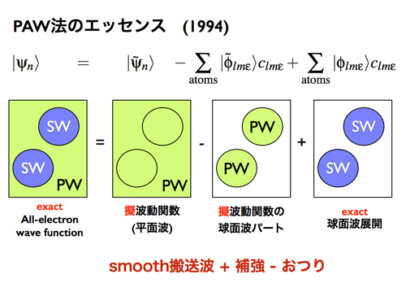

そのため計算には擬ポテンシャルが必要となります。近年ではこの
ように、PAW法などのアイデアに基づいた基底関数やその拡張されたものが用
いられることが増えており、従来までの基底の欠点が徐々に解消されつつあります。
一見すると全く別のものようですが、PAW法の基本アイデアを忘れなければ大雑把には、
簡単に整理分類できるかと思います。また本文章で多用する表現ですが、VASPなどで
用いられているPAW法は、擬ポテンシャル（滑らかな平面波基底)に基づくPAW法なので、
PP-PAWと表現することは（少しマニアックですが）私個人の独自の記法ではなく、
わりと一般的な記法です。

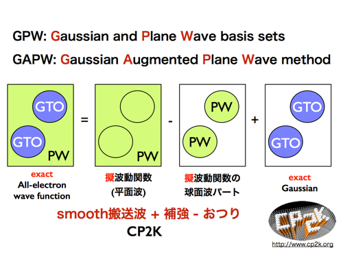


## 基底関数からの第一原理計算コード分類のまとめ

これまでのお話を簡単にまとめたいと思います。殆どの場合はここまでの知見を元に、
整理整頓してコードを比較検討できるかと思います。本ドキュメント中にて多くの場合
AE と記述しているのは全電子計算の意味です。つまり内殻の電子状態を計算していること
を意味します。たとえば、FLAPW は全電子計算手法なのでここでは、あえてAE-FLAPW と
書くことがありますが、この表記はあまり一般的でありません[^20]。同じように、あえて、
AE-GTOなどとも書いていますが、普通は書きません。FLAPWやGTOは全電子なのは当たり
前だからともいえます。ただし、ここでは分類上明確にするためにあえて書いています。
先ほど書きましたが、擬ポテンシャルに基づくPAW法はPP-PAWと書いています[^21]。
ウルトラ
ソフト型擬ポテンシャル（USPP)はそもそも名称にPPが書かれていますが、ここではしつ
こくPP-USPPなどと（場合によっては）書いています。普通は書きません。wavelet基底
などマニアック？な基底ですと擬ポテンシャルなのか、全電子なのか知らない人は知らない
ので、PP-Wavelet と書くのは親切だと思いますが、書いてあるのは見たことが無いです。
同じように、今回説明しませんでしたが、局在基底のうちの一派で、数値局在基底(PAO
もしくはNB)を用いた計算コードである OpenMX と SIESTA ですがPP-PAO と書いています。
この表記はわりと一般的です。これに対して、同じく数値基底を用いた FHI-AIMS が
全電子計算なので、ここではAE-PAO と書いていますが、この表現はあまり一般的ではないと
思います。ここでの表記は私の独断と偏見での表記ですのであまり公には使わないことを
お薦めします。また、本文中、もしくは脚注で紹介した、FDMNES、RSPACE については
基底関数展開に基づいていないので除いています。また、PMT法にもとづく ecalj は
一覧表に書くスペースがなかったので書いておりません。申し訳ありません。同じ理由で
世の中に山のようにある他のコード（特に擬ポテンシャル系コード）はここでは載せて
いません。また本文中では流れの都合ほとんど述べませんでしたが、KKR-Green関数法は
実用上の意味もあって、現代でも重要な計算方法です。APW法とKKR法の対比、LAPW法と
LMTO法の対比はそれの理解にはむしろ必須であり避けては通れません。ただ、今回はKKRも
含めて全部一緒に説明ストリーを作るのが非常に長く煩雑になりそうだったので都合除
きました。何かの機会に別の構成でお話出来たらと思います。実用上の意味では、KKR法は
MT近似の元で発展してきた手法ですが、現代ではfull-potential 化もなされています。
ただし、一般の方でも使えるような形で、full-potential-KKR法で公開されているコード
は現状ではないはずです。公開されている範囲でのAKAI-KKRやSPR-KKRはMT近似の範囲です
ので、適応する系には注意が必要です。ただしGreen関数法であるがゆえにCPA法の導入が
容易であるため、合金の計算などには圧倒的な威力を発揮します。また、KKR法を線形化
したLMTO法ですが、MT近似の範囲でLAPWと同程度の計算をするのならば基底の数が恐ろ
しく少なく済むので計算速度が恐ろしく速いです。ただし、MT近似に基づくKKR-Green法と
同じく、充填率が低い系では計算があまり合いません。ただし、充填率が低くても、原子
番号０のES(エンプティスフィア)と言われる仮想原子を導入していくとある程度は計算が
合うようになります
が、この導入には任意性があるため、経験を有します。これらMT近似の問題を突破する
full-potential版であるFP-LMTOは、結果的にはFLAPWとほぼ同程度の精度と同程度の計算
の重さになるため、実際問題それほど普及はしておりません(すでに同等のことが出来る
FLAPWが先行して存在します）。他にも実用上重要な話や計算コードはいろいろあるかと
思いますので異論あるかもしれませんが、本ドキュメントではとりあえず前ページのように、
コードをまとめました。

基本的に載せたコードは代表的なコードであることを重要視
しています。また、当然、私の趣味も入っています。量子化学系のコードもスペースの
都合、Gaussian と ADF しか書いておりません。量子化学系のコミュニティで開発され
ている局在基底基底系のコードは、コミュニティの規模から言って実は最も開発されている
数が多いDFTコードだと思います。実は最大手です。おそらく使われている方も多いと
思いますが、ここではほとんど述べません。

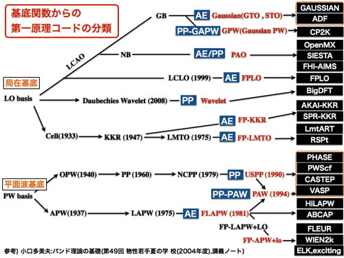


[^20]:  一般的どころかだれもこのような書き方はしないので、公に使うと恥をかきますのでご注意です。

[^21]:  PP-PAWという書き方は一般的な記法ですが、少しマニアックではあります。


## 世界の計算コード

以上までのことにより、特に基底関数を中心としたコードの基本的な違いを理解する知見は
得られてきたと思います。そこでまず、wikipedia の第一原理計算コードの一覧表を見てみます。

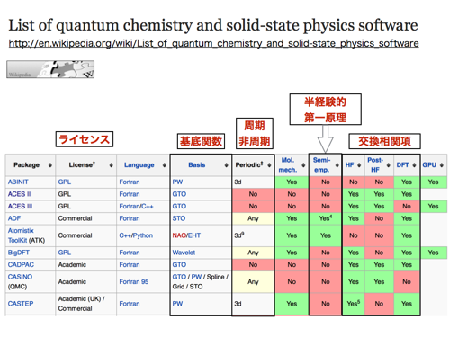

所々怪しいものもありますが、基底関数や周期系・非周期系などの情報が一覧表で書かれて
いるために、非常にわかりやすく分類されています。基底関数の基本的な分離がわかって
いれば、おおよそそのコードの特徴がわかります。たとえば、お話ししてきたように基底関数
が局在基底の場合は、つまりGTOやSTOの場合は、大抵は非周期系の計算コードです。これらは
大ざっぱには分子系の計算コードと思っていただければと思います。量子化学系の
コミュニティで主に作られています。無論、局在基底でも周期系の計算が出来るコードも
あります。また、基底関数がPWなどの平面波基底の場合は、大前提としては周期系の計算に
なります( 3d と書かれています)。こちらは主に物理系のコミュニティで開発されており
まして、基本的にはバルクの計算に力を発揮します。PW基底の場合は周期スラブモデルなど
周期モデルに工夫をして、分子や表面の計算などもわりとリーズナブルなコストと精度で
起算可能です。また、交換相関項はポテンシャルを計算する際の近似方法の違いになります。
重要なのですが、今回は話の流れが判らなくなるので一切説明しておりません。とりあえず、
DFT と書かれていれば、ようするに普通の第一原理計算です。HFは交換項のみ厳密に解ける
手法、Post-HFは交換項のみではなく相関項の近似のレベルを上げたものと思ってください。
DFTと比較して一概に優れているものでもありません。Semi-emprical は経験的なパラメーター
を含みますので初学者は避けた方が良いかと思います。また、実用上は、実はライセンスの
区分が一番大切かもしれません。注意が必要です。GPLはご存じの用にオープンソースで
よく用いられているライセンスです。コードを使って計算をする場合は無償で使えますし、
普通にダウンロードが出来るかと思います。当然、GPLライセンスのコードを改変したり
ソースコードを流用したりする場合はGPLライセンスに従う必要があります。Academic の
分類はコードのライセンスとしてはどちらかというとMIT/X11 ライセンスあたりベースと
した独自ライセンスが多いのですが、それぞれのライセンスを確認してください。どちら
かというと大学などの研究機関で使うことが前提の場合が多いです。さらに、Academicの
場合はコードの入手は大抵は作者にメールを送るか、Web上でメールアドレスと所属など
の登録が必要だったりします。企業で使う場合は注意が必要です。また、これら第一原理
計算コードは Fortran を用いた書かれていることが多いので注意が必要です。希に C 言語
と書かれているコードもありますが、特定のソルバーが実は Fotran で書かれていて
 Fotran コンパイラーも必要な場合があります。このように、wikipediaのこのページは
一覧表形式なので情報量は少ないですが、コードの重要な違いに関しての、見通しは良い
かと思います。また、wikipedia のような海のものと山のものともしれないページとは
異なる、専門家による紹介ページがあります。wikipediaよりは登録されているコードの数が
減る場合がありますが（増える場合もあります）CMSIのMateriAppsでも同様にコードが
紹介されています。本文文章で述べたような、擬ポテンシャル法といったキーワードを
知っていればMateriAppsのページは多くの情報を与えてくれる素晴らしいページになるか
と思います。コードの紹介が丁寧にされております。いろいろ眺めているととても役に
立つコードを発見できるので探索してみると良いかと思います。

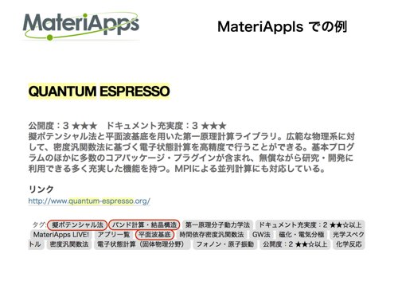


## どの計算コードでも計算可能な物理量

世界中の計算コードが山のようにあるのが判ったと思いますが、実際どれを使ったら良い
のか初めての場合途方にくれることになると思います。計算コードの基底関数ごとに得意
不得意な物質系がある事はお話ししたとおりですが、それを除けば、実際問題、どのような
計算コードを使っても、基本的な電子状態の計算はされます。特に、PW基底などを用いた
計算コードは山のようにありますが、ある程度はどの計算コードを使っても同じような
仕事が可能です。たとえば、ある構造の全エネルギーを求めることが出来ただけで下記の
図に示したような非常に多くの物理量の計算や議論が可能となります。当然、電子状態の
計算をしていますので、波動関数、電荷密度、などは計算してますので、局所状態密度や、
バンド分散、フェルミ面などもどの計算コードでも計算可能です。ではどのコードを使って
もまったく同じか？といえば当然ですが微妙に異なります。近似方法の問題とは別にコードの
完成度の問題もあります[^23]。

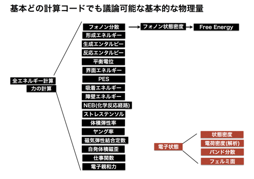

[^23]:  擬ポテンシャル法ならば、前述したように擬ポテンシャルのトランスフェラビリティー(移植性)の問題もあり、用意された擬ポテンシャルが計算したい構造で正しい結果が得られるかの保証は、コードによっても（用いる擬ポテンシャルによっても）異なります。

## 特定の物理量が算出来るか？XANESスペクトルの計算ができるコード

これまでな脚注等でしつこくは話してしましたが、X線微細構造の計算には当然ながら
内殻の計算が必要となります。つまり、ほとんどの場合は、局在基底であるSTOやGTOベース
であったり、FLAPW法である必要があります。同じくPP-PAW法や GPAW法から計算も可能です。
また、KKR法に基づく全電子計算手法でも当然ながら XANESの計算が可能です。むしろ
Green関数を用いた多重散乱理論に基づく計算コードでXANESやEXAFSの計算をするのは
XAFSのコミュニティではメインストリームとなります。とりあえず、これらメジャーな
XANES計算が可能なコード（＋計算出来ないけど分類上なんとなく載せたコード）を
まとめてみたのが次の図になります。前述した基底関数からの分類表とほとんど同じ表
ですが、それぞれの計算コードで XANES の計算が出来るコードに特に着目しています。
本記事ではほとんど述べなかったFDM法を用いたXANESスペクトル計算コードも一緒に
書いております。GPAWコードのようにFDMやLCAOやPWといった差分法、局在基底、平面波
基底など多くの基底に対応したコードもあります。実際に研究に用いる
ときにはL吸収端の計算が出来るか？が重要な場合は注意が必要です。たとえば、CP2K、
GPAW、Quantum Espresso では、少なくとも公開されているバージョンでは L吸収端の
計算が出来ません。L吸収端の計算をしたければ、WIN2kなどのFLAPW計算コードにするか、
CASTEPなどの商用のソフトにする必要があります。CASTEPと実際のところほぼ同じコード
であるVASPは現段階ではL端どこかXANESの計算自体が出来ません[^24]。その意味では、バルク
の場合でしたら計算が重くても、WIEN2kを使えばL端も含めてXANESの計算が出来るのです
が、分子系や表面系だとL端までを含めた計算が出来るコードの選択肢はあるようでほと
んどありません[^25]。

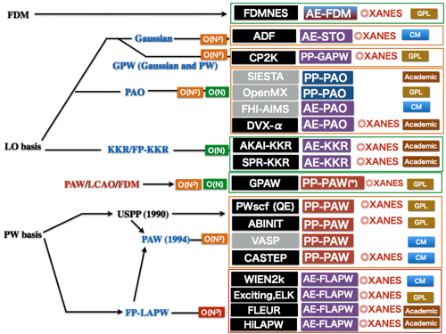


[^24]:  VASPとCASTEPは共にPWベースで、USPP,PAW基底で計算可能なほぼ同等のコードです。それぞれ独自に発展してきてますが、コードとしての起源も同じコードから派生してます。理由は知りませんが少なくとも公開されているバージョンではVASPはXANESの計算が出来ません。ホールを開けた擬ポテンシャルが用意されてないので、おそらく隠しオプションでも存在してないと思います。

[^25]:  AKAI-KKRやSPR-KKRは私自身はCPAを用いた基本的な計算の経験しか無いので、XANESがL端を含めて計算出来るように公開されているか？は知りません。そもそもL端の計算は、スピン軌道相互作用の問題、励起状態の計算問題、電子相関の問題といろいろな問題が絡んできますので、意外に難しく、K端ほどは信頼して実験と比較するようなモデル構造を立てて計算して議論する難しいです。つねに実験との検証が必要です。また、当然公開されているバージョンではこれらKKR-Green関数法のコードは MT近似の下で計算されるという制限があり、計算する物質系に二は様々な制約があり、計算には工夫が必要です。


## その他の物理量の計算、連携する計算コード

XANEの計算は内殻の電子状態の計算が必要だったために、計算コードの選択に著しく選択
の幅が出てしまいました[^26]。他にもたとえばマリケンの電荷密度解析のように局在する波動
関数を元にした電荷密度解析などは平面波基底では行うことは出来ません。これに対して
近年では電荷密度解析は、Baderによる実空間の電荷密度解析などの開発が進んでおり、
平面波基底ベースでも実空間Mesh上の電荷密度に対する解析[^27]が可能となっています。
他にも本来局在基底ベースでのみ解析できたようなCOHP解析などによる結合解析も、
近年では特定原子の特定の軌道成分に射影することによる pCOHP解析がなどが開発され、
局在基底ベースで行われるような結合解析も平面波基底でも広く解析が可能になっています。
これらは計算コードのパッケージ内に含まれている場合もありますが、計算後に別コード
の解析プログラムから、計算した電子状態を読み込んで解析などが可能となる場合が多いです。
国産の Phase という PWベースの計算コードは国プロ絡みで誘電関数など多くの物理量の
計算が可能なパッケージを含んでいますが、これらは基本的には Phase の計算結果を
使った解析となります。これに対して、近年では計算コードの多くが、GPLライセンスなど
のオープンソース化していることもあり、多数のプログラムが連携して動作する事が可能な
ケースが多いです。これにより、電子状態の計算と物理量の計算を別のコードで行うことが
増えたために、基本となる電子状態の計算は計算したい物質系に合わせた、自分の慣れた
コードで行うことも可能です。実は個々では言及していませんが、海外の計算コードの
多くは、たとえば電子相関のソルバーやら大規模計算の固有値問題のソルバーなど、計算の
基本機能の部分に関しても部品化は割と進んでいます。以前は一つのグループですべての
計算に必要なソルバーが独自実装されていたのですが、最近はこういったオープンソース的
な手法で多くの計算コードが開発され、多くの部分が部品化されつつあります。当然、
様々な近似や異なる計算コードを渡り歩く危険はあります。何が問題の本質か見えにくく
なりますし、異なる近似を無策につなぐのは危険です。ただ、物理とは言え計算コードは
プログラムであり、ソースコードをGPLで配布していく形態が増えてきた現状、同一の
理論に基づく仕事に関してはどんどん共有化が進むような開発の状況へと変わっているのが、
少しずつ見えてくるような気がします。

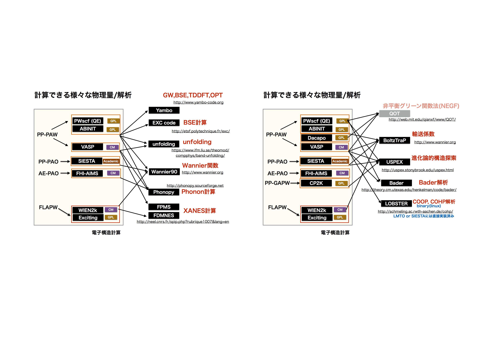

[^26]: それでも近年はPW基底ベースにおけるPAW方の開発により、多くの場合は平面波ベースでもXANESの計算も可能になってきてます。

[^27]:  たとえば、価数の計算などのことです。


## 計算コードのシェア

これまで、様々な計算コードがありその計算コードを基底系で分類し、得意な物質系など
について分類してきたと思います。そして計算コードによって計算可能な物理量により、
特定の計算コードでないと計算出来ないようなものがある事。そして、それでも近年は
多くのコードが連係して動作するために、計算後に別のコードで計算し物理量を得ることが
可能場合がある事等です。ただ、実際にユーザーとして計算コードを選択する場合の、
ある意味最大の理由はおそらく計算コードのシェアであるのが実態であるかもしれません。
シェアが多いコードは情報が多く出回っているし、そして多くの人に使われるのでバグ
フィックスも盛んで、議論も豊富で、ユーザーの希望に答えている。「特定の物理量が
この計算コードでないと計算出来ない！」という特殊な事情以外の場合は、ほとんどの人
は計算コードに求めることは多くは無いと思います「収束が良い」「速度が速い」
「結果が信頼できる」の三点に集約されるかもしれません。マイナーなコードでも良い
コードはたくさんあります。でもやはりシェアが高いコードはシェアが高いなりの理由が
あり、やはりかなり優れています。

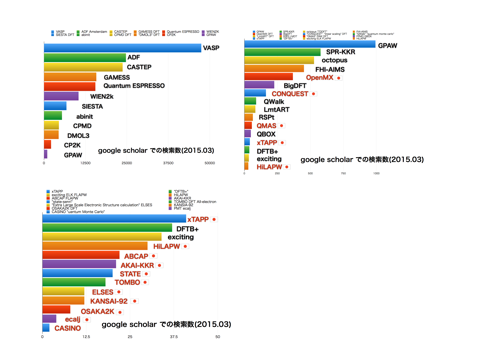

[^28]:  変な例えですが、90年代後半のOS戦争当時の、Windows 9x vs. OS/2 vs. その他諸々 を制したのはある意味当時もっとも出来の悪かった Windows (windowsが最悪のOSだったのに異論はあるかもしれませんが、マイナーなOS/2が当時のWindowsより素晴らしかったのに異議を唱える人はいないでしょう)だったのを覚えている人がどれだけいるでしょうか？業界とはず、シェア（数）は最終的にはその評価は名実共に本物になると思います。

そして、シェア争いに勝利すれば、最終的にはシェアが
多いものは
本物になります。コードの選択と検索キーワードにいささか文句があるかもしれませんが、
Google Scholar で検索した論文数が下記の図になります。量子化学系のコードは除いて
おります。たとえば Gaussian などを乗せると名前が一般的すぎで計算コードのGaussian
だけをピックアップするのが難しいというのもありますが、それでも検索数を絞っても、
下記の結果の最大数であるVASPよりは一桁以上論文数が多いです。化学と物理の世界の
人口比率を思えば当然かもしれません。他には、先に少し話を振った Phase ですが、
これは名前が一般過ぎて検索を絞るのが大変だったので（絞りすぎて公平感がなくなる）
この図から除いております。計算物理系の会議での発表ですと「VASP」で計算しましたが・・・
と恥ずかしそうに話す人も多いですが、コード開発が仕事ならばともかく、計算からの
議論が主目的であるのならば、コードに貴賎はなく、むしろ自らの問題解決に最も適した
コードを選択するべきです。その意味ではシェアの大きいコードを使うことは恥ずかしが
ることではなく、むしろ誇るべき事でもあるかもしれません。京のような超大規模並列で
はまた事情は異なりますが、VASPはかなり並列化効率も高いですので、一般的な規模の
クラスターではわりと良い仕事をしてくれます。無論、クリロフ部分群などの大規模計算
向きのアルゴリズムが効いてくる規模の計算で VASP をむりやり選択するのは辞めた方が
良いです。そのあたりは大規模計算のお話でもしたときに、まとめられたらと思います。

## 計算コードのまとめ

割と独断と偏見ですがこれまでの計算コードに関するまとめを大ざっぱにしたいと思います。
花自体はこれまで話してきたことを繰り返すだけですが、主に実情の観点から、メモリの
消費量。
小規模計算での計算速度、大規模計算での計算速度、電子状態の収束性について局在基底系
と平面波基底系の違いについて区分しております。さらに、同じ局在・平面波基底系の
なかで、擬ポテンシャルなのか全電子なのか？で区分し、それぞれ構造緩和計算の得意
不得意、さらには固体が得意なのか分子や表面が得意なのか？について一覧的にまとめま
した。ここでいうろところ、△印と〇印の間にも多くの段階があり、人によって「いや違う！」
と主張されるところも多々あるとは思いますが。そこは溜飲を下げていただいていた
だけたらと思います。わりと大ざっぱな傾向と広い心で見てください。初学者にとっては、
だいたい実感的にはそれほど間違った印象は無いと思います。全体的に見ると、平面波基底
がわりと万能っぽく見えます。これは分類した項目のうち、構造緩和の計算が得意なのが
平面波基底だけであるため、嫌でも3つの項目のうちの一つが埋まるからですが、実際問
題平面波基底+擬ポテンシャルはわりと平均的に万能です。特定のものに尖って優れている
わけでもないのですが（構造緩和は非常に優れている）、世の中の擬ポテンシャルコード
の発展を見れば、その業界の裾の広さが判るかと思います。また分子系に限れば当然、
量子化学系の計算コードが圧倒的に優れており、解析も豊富で計算コストのパフォーマンス
も優れています。利点欠点それぞれです。適材適所を心がけてください。

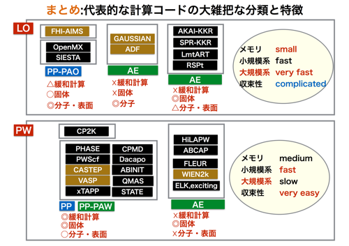
