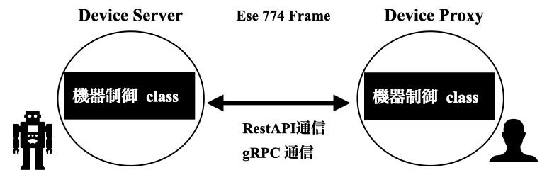
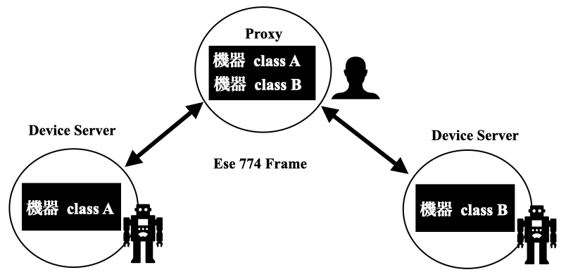
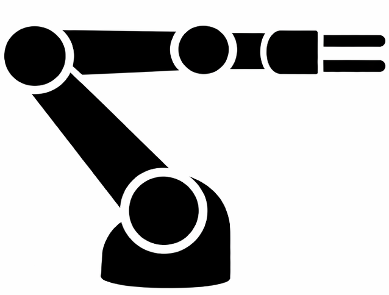

# Ohara Lab | Software
Software for data analysis and device control used in our research projects.  
[尾原研](https://ohara.mat.shimane-u.ac.jp/) / [ohara-lab-su (github)](https://github.com/ohara-lab-su) / [ohara-lab-su (docs)](https://ohara-lab-su.github.io/)

<!--
* Toc
{:toc}
-->

# デバイスサーバ docs, src

**(*) 2026/03/03 ソースコードにはアクセス制限あり**

以下は各機器ごとに**制御プログム**と
スサノオに対応した**デバイスサーバー**が公開されている。そのドキュメントである。
機器制御側は基本的に全てスサノオとは独立して記述してあるために、
**他の機器制御フレームからでもそのまま使える**。
スサノオを使われない場合でも下記の制御クラスはぜひ使っていただければと思う。

- ロボット制御class: [cobotta](https://ohara-lab-su.github.io/cobotta2/) / ([source](https://github.com/ohara-lab-su/cobotta2/))
- ロボット制御class: [cobotta 文字書き](https://ohara-lab-su.github.io/glyph_motion/), ([source](https://github.com/ohara-lab-su/glyph_motion/))
- ロボット制御class: [UR (UR3e)](https://ohara-lab-su.github.io/ur/), ([source](https://github.com/ohara-lab-su/ur/))
- ロボットGUI: [cobotta_joypad (GUI)](https://ohara-lab-su.github.io/cobotta2_joypad/), ([source](https://github.com/ohara-lab-su/cobotta2_joypad/))
- 電子天秤制御class: [aandd_reader](https://ohara-lab-su.github.io/aandd_reader/), ([source](https://github.com/ohara-lab-su/aandd_reader/))
- 二次元検出機class: [MiniPIX](https://ohara-lab-su.github.io/mini_pix/), ([source](https://github.com/ohara-lab-su/mini_pix/))
- マルチメータclass: [xdm1000](https://ohara-lab-su.github.io/xdm1000/), ([source](https://github.com/ohara-lab-su/xdm1000/))
- モーター制御class: [ツジ電子PM16C](https://ohara-lab-su.github.io/pm16c16/), ([source](https://github.com/ohara-lab-su/pm16c16/))
- モーター制御class: [ツジ電子PM2CD](https://ohara-lab-su.github.io/pm2cd/), ([source](https://github.com/ohara-lab-su/pm2cd/))
- 画像転送class: [n10w02 (コボッタ付属カメラ)](https://ohara-lab-su.github.io/n10w02/), ([source](https://github.com/ohara-lab-su/n10w02/))
- 画像転送class: [web cam (OpenCVを使ったカメラ)](https://ohara-lab-su.github.io/image_server/), ([source](https://github.com/ohara-lab-su/image_server/))
- 粉体の位置測定class: [powder-level-monitor](https://ohara-lab-su.github.io/powder_level_monitor/), ([source](https://github.com/ohara-lab-su/powder_level_monitor/))
- 通信Frame: [ese774 frame](https://ohara-lab-su.github.io/ese774_frame/), ([source](https://github.com/ohara-lab-su/ese774_frame/)) SPring-8 BL774互換風味
- 通信Frame: [gRPC frame](https://ohara-lab-su.github.io/grpc_frame/), ([source](https://github.com/ohara-lab-su/grpc_frame/)) 高速な gRPC 転送用
- 通信Frame: [TANGO frame](https://ohara-lab-su.github.io/tango_frame/), ([source](https://github.com/ohara-lab-su/tango_frame/)) beta-stage
- 通信Frame: DDS frame
- メール送信サーバ: [notify_server](https://ohara-lab-su.github.io/notify_server/), ([source](https://github.com/ohara-lab-su/notify_server/))
- ロガーclass: [x_logger](https://ohara-lab-su.github.io/x_logger/), ([source](https://github.com/ohara-lab-su/x_logger/))

- webカメラ制御: [camera_control](https://github.com/shimane-dev/web_camera) webカメラ画像を gRPC 転送するだけ (alpha stage)
- websocketカメラ制御: [websocketによるリアルタイム通信 (過去資産+次のあれこれ alpha版)]()
- [過去資産の移行](susanoo_porting.md)

---

# スサノオとは？

島根大学が開発する、SPring-8 の **[BL774](https://user.spring8.or.jp/sp8info/?p=42759)** 互換(ese774)
を用いた一連の計測システムを
**S**ustainable
**U**nified
**S**ystems
**A**rchitecture
for
**N**etworked
**O**perations
and
**O**rchestration
スサノオ(SUSANOO)と読んでいる(*)
測定・解析・可視化・判断などをトータルで扱うための、
**デバイス単位の緩やかな結合**を基本思想としている。

(*) 名前は変わる可能性がある

## システムの概要

スサノオでは SPring-8 における [MADOCA/DARUMA](https://user.spring8.or.jp/sp8info/?p=37181) や
ESRF の [TANGO](https://www.tango-controls.org/) のようなフルスタック型の
のプロトコル・フレームワークを新たに構築することは目的としない。

MADOCA や TANGO もデバイスサーバー単位で構成されているが、
そのデバイスサーバー群を支える共通基盤は大規模である。
スサノオでは、gRPC /FastAPI(BL774互換) などを用いた軽量なマイクロサービスとして
デバイスサーバーや解析機能を作成し、
必要なものだけを緩やかに結合する。

ターゲットとなるデバイスと目的の通信速度・フレークワークとの結合をしやすいように、
フレームを切り替えても同じように使えるようにする。
基本は**シンプルな透過型プロキシ**を採用している。

[BL774](https://user.spring8.or.jp/sp8info/?p=42759)
互換としての立ち位置は、
公式に**BL774 REST server** のコードを基盤にしており、
get や post のルールを
[BL774](https://user.spring8.or.jp/sp8info/?p=42759)
側の真似をしているところである。
ただ、マネージメントやAPIセットにははまだ大きな規定や仕組みはない。
つまり774APIセットに対応しているわけではなく、
774 Basic System 未満である。

基本センスとしては、スサノオはフレームワーク側として API を統一整理する代わりに、
制御クラス側に API の規定は任せている。
つまり、透過型プロキシとして動的ディパッチを軸としたフレームであり、
制御クラス側の python の API がそのままクライアント上での API となる。
APIを揃える場合は制御クラス側で揃える。

これは、最初からデバイスサーバーを増やす前提のもとで設計されているためであり、
デバイスごとに基本となるAPIが異なるためだ。モーター系などすでに揃えるべきAPI
セットが固定なものを扱うことよりも、**多種多様なデバイスに対する対応の容易さ**の方を重視している。
いいかえると徹底的にミニマム志向で作られているともいえる。

- [方針メモ](susanoo_intro.md)

## ロボット制御

特にスサノオ(仮)の自動化の中核として、ロボット制御のデバイスサーバーが上げられる。
当然ロボットに関しては各社独自のフレームワークなど、大変な力を入れている。
それらを置換するものではない。
各社のロボットは、ハードウエア的な目的が異なるために I/F の違いが大きい。
スサノオではこれらをある程度統一的な API-I/F として揃える。
つまり各社APIの緩やかな抽象化を行う。
各社を横断したAPIセットは、大学らしい、メーカーではできない設計となる。
各社の違いを超えて、実験する人が容易に置き換えることを目的としている。

## デバイスサーバー単位の緩やかな結合

自動化・自立化などの大きな枠組みを作らずに、あくまでデバイスサーバー単位での緩やかなシステム構成を
中心に添えるのがスサノオ(仮)である。
それはフィジカルAT時代に対する一つの回答であるのは言うまでもない。

どのような汎用 API を用意して、どのような大きな構成を見据えた巨大なフレームワークを作っても、
最終的には AI による命令・実行に置き換わることは、目に見えて明らかであるからだ。

その時に残るシステムバックエンドは、保守メンテナンスに優れたデバイス単位のミニマムな
構成である。インテリジェントは構成はその上位に任されば良い。

上位の実験シーケンスや知能化の手法は今後も変化していく。
一方で、長く利用されるのは、保守性に優れたデバイス単位のコンポーネントである。
スサノオでは、そのような下位レイヤーをできるだけシンプルに保ち、
上位の知能化や自動化は利用者が自由に構築できるようにする。

## 解析や可視化ソフトとの結合による自立実験

スサノオ(仮)では、それぞれのデバイスがが分散環境化において、ネットワークを意識しない形で配置される。
つまり、ハードウエアはただのデバイスオブジェクトである。
これは何を意味するか？
つまり解析用のプログラム・オブジェクトとの結合である。
デバイスオブジェクトを広く展開することで解析を含めた完全なh自律的な自動実験に
容易にシフトすることが可能となる。

---

# 分散システム

スサノオでは [MADOCA/DARUMA](https://user.spring8.or.jp/sp8info/?p=37181) や
[TANGO](https://www.tango-controls.org/)
のような本当の意味での分散システムは目指さない。
つまりサーバー・サーバー間通信を前提とした意味での分散ではなく、
単純なサーバー・クライアント通信がベースのシステム構成とする。
ミニマムな実験支援系システムではそれほど本格的な分散システムは必要ないという判断が根底にあるからだ。
単純に [BL774](https://user.spring8.or.jp/sp8info/?p=42759)
型の互換であるからという理由もあるし、
設計・開発・保守メンテナンスをミニマムなコストで行うためである。

- [(1) 機器制御における分散モデル](susanoo_dcs_intro.md)
- [(2) 分散ノード通信の基盤](susanoo_dcs_com.md)
- [(3) スサノオのシステム](susanoo_system.md)
 
[BL774](https://user.spring8.or.jp/sp8info/?p=42759)
はメインとしては RestAPI を採用している。
これは大変遅い通信である。
しかし、webに立脚した技術体系の普及率と裾の広さ、簡便さには捨てがたく、
RestAPI に立脚することは、遅い機器制御においてはそれほど間違っていない。
開発効率と一般的で普及しているシステムであることは何より大切である。
同システムのサブセットであるスサノオも同等である

それに対して、
それなりに高速な通信やイベント起動などの高度な通信が必要な場合も存在する。
この場合は、
[MADOCA/DARUMA](https://user.spring8.or.jp/sp8info/?p=37181) や
[TANGO](https://www.tango-controls.org/) のような ZMQベースの通信が
圧倒的に有利になってしまうが、
同じ web技術の範囲でも gRPC ならば、バイナリ通信であり、選択肢としてそれほど悪くない。
(実はデンソーウェーブのORiN3でも gRPC に進んだのはある意味トレンドを彼らなりに、採用は遅いにしても、
追いかけた結果と評価できなくもない)
そのような gRPC を web通信のカテゴリの一種として、スサノオでは選択可能になっている。
この gRPC への拡張は本家BL774でも行われており、
BL774対応の一つでもある

分散環境というチョイスでは、世界的標準になりつつあるのは、DDS であり、
最初から DDS ベースで設計するというのは一つの手段として正解である気もしないでもない。
その視点で最初から DDS ベースで作ったものが、ロボットベースでよく使われる、ROS2 という
フレームワークである。

webベースであるか？DDSのような本格的な分散ベースか？の選択肢となるが、
スサノオでは BL774 ベースであるため、DDSベースはとりあえずはコアライブラリとしては除外する。
DDSとの接続はロボットを使う上では必須であるため、枠組みに入れていく形にする。

---

# 導入

## インストール方法

スサノを構成する基本モジュールを導入する

- [スサノオの基本構成のインストール](susanoo_install.md)

次にデバイスサーバーを導入する必要がある。 
後述する、すでに開発済みのデバイスサーバーを使うだけならば次のセクションは飛ばして良い

## デバイスサーバー作成

スサノオは、サーバー・クライアント型のシンプルな分散システムである。
そのため、使用するにあたっては、デバイスサーバの形でデバイス(実験機器)側の
サーバーを立ち上げる必要がある。
スサノオはほぼ完全な透過型プロキシであるため、
基本は制御クラス(デバイスクラス)があればデバイスサーバー・クライアント作成はほぼ終わる。

1. スサノオに関係なくデバイス制御クラス(プログラム)を書く。 
2. スサノオフレームを用いて、デバイス制御プログラムからデバイスサーバーを作る (**わずか数行**)
3. スサノオフレームを用いて、デバイスサーバーの**API定義**を記述する (ある意味これがサーバを作る作業の本丸だが、実はただのコピペ作業)
   pydantic/OpenAPI という一般的なweb技術とその記法で記述されており スサノオが用意するクライアントを使わなくてもデバイスサーバーを使うことができる
4. スサノオフレームにより自動で作られるデバイスクライアント用いて、 実験制御プログラムを書く。
 
この4つのステップで機器制御・開発を行う。
4の作業をより簡略化するために、1 をうまく作ると良い。すでに我々他用意しているものはこの後のセクションにある。
これらの具体的作業を下記に記す

- [スサノオに対応するデバイスサーバの作成](susanoo_device_server.md) (自分でデバイスサーバーを作る場合)

実際にデバイスサーバーを作る例を下記に示す。
すでにデバイスクラス(機器制御用のクラスが存在するとき)にデバイスサーバーまでを作る例である。

- [cobotta制御サーバ (ese774)](https://ohara-lab-su.github.io/cobotta2/tutorials/install_server.html) の導入
- [cobotta制御クライアント (ese774)](https://ohara-lab-su.github.io/cobotta2/tutorials/install_client.html) 導入
- [電子天秤サーバ (ese774)](https://ohara-lab-su.github.io/aandd_reader/tutorials/intro.html#a-ese774) の導入
- [電子天秤クライアント (ese774)](https://ohara-lab-su.github.io/aandd_reader/tutorials/intro.html#a-ese774) の導入0

クライアントコードは async 対応であるが、厳密にはサーバー側の制御 class が非同期に正しく対応してないと
唯のハッタリ async となる。
もともとサーバーとクライアントで分離しているために、
同期非同期はそれぞれの責務となる。
クライアント側の責務は async と sync には正しく対応している。
問題はサーバ側、つまり機器側の対応になる。
つまり、async で非同期並行処理っぽく見せていて、
サーバー側はコテコテのマルチスレッドやマルチプロセスで、非同期並列処理となっている場合がありうる。
注意が必要である。この非同期性の担保・実装は個別のデ**バイスサーバーの責務**となる。
原理的に不可能なデバイスも多い。

## 実験用サンプルスクリプトと環境構築 docs

**(*)研究室の学生向けのドキュメント**

実験制御をするエンドユーザーにって簡便であること。これがスサノオの究極的な目的である。
スサノオ使用者はロボット制御のプログラムも通信のプログラムも複雑なプログラムを書くことも理解する必要もない。
python は多少は知っておく必要はある。

おそらく、学生にとっては cobotta やスサノオのシステムの導入より、
サーバーPC と python 環境などの環境構築が大変な障壁になる。
以下にに学生の試行錯誤の記録を記す

 [Ohara Lab Slack Robo Channel](https://w1769571594-yzx230902.slack.com/archives/C0AJHG8VBA5/)

- [簡単なシーケンススクリプト例](susanoo_robo.md)
- [学生が書いた学生向けドキュメント (研究室内部doc)](https://github.com/shimane-dev/docs/tree/main/cobotta_setup/ohara_lab.md)
- [学生が書いた学生向けドキュメント (公開を目指している途中doc)](https://github.com/shimane-dev/docs/tree/main/cobotta_setup/cobotta_setup.md)

<!--

-->

●

---

# 計算・解析オブジェクト

実験制御たるデバイスサーバー（デバイスクラス）と連携する計算・解析オブジェクトを提供する

## 計算・データ解析 (RMC): source

**(*) 2026/03/03 アクセス制限あり**
主に逆モンテカルロ(RMC)を用いた計算・データー解析とそのための支援ツールなど。

- [Packmol_util](https://ohara-lab-su.github.io/packmol_util/) / ([source](https://github.com/ohara-lab-su/packmol_util/)) 非晶質の構造作成
- RMC (FNC) 形状固定の方法 / ([支援ライブラリ](https://github.com/ohara-lab-su/rmc_dft/tree/main/src/rmc_dft/rmc_pot))
- RMC (TOP) ポテンシャル利用 / ([支援ライブラリ](https://github.com/ohara-lab-su/rmc_dft/tree/main/src/rmc_dft/rmc_pot))
- [RMC (SNC) Qn Network](https://ohara-lab-su.github.io/qn/) / ([source](https://github.com/ohara-lab-su/qn/)) RMC_POT 用の Qn network 作成支援
- RMC (ANN) 機械学習ポテンシャル利用 (ANETのANNポテンシャル) / ([支援ライブラリ](https://github.com/ohara-lab-su/ann_env)) ANN 作成/利用 支援ライブラリ
- [RMC-DFT](https://ohara-lab-su.github.io/rmc_dft/) / ([source](https://github.com/ohara-lab-su/rmc_dft/)) RMC/DFTに関するクラスライブラリとRMC-DFT計算コード
  - [RMC-DFT: RMC 支援クラスライブラリ](https://github.com/ohara-lab-su/rmc_dft/tree/main/src/rmc_dft/rmc_pot)
  - [RMC_DFT: VASP 支援クラスライブラリ](https://github.com/ohara-lab-su/rmc_dft/tree/main/src/rmc_dft/vasp)
  - RMC-DFT: QE (Quantum Espresso)支援クラスライブラリ
- [RMC-MLP: ACE](https://ohara-lab-su.github.io/ace_env/), ACE を MD/DFT の代わりに使うための支援
- [RMC-MLP: GAP](https://ohara-lab-su.github.io/gap_env/), MLP を MD/DFT の代わりに使うための支援。苦労の苦労の割には報われない気がする。それよりは、RMC の制約・補正としての ANNが RMC
- RMC-MD: LAMMPS
- [webPDF の Rust 版（パラメター自動調整版)](https://ohara-lab-su.github.io/rust_pdf/web/) / ([source](https://github.com/ohara-lab-su/rust_pdf/))
- [webPDF local](https://github.com/kengo-nakada/local_pdf) 廃止予定/Rust版へ統合

## 計算・データー解析 (MD): source

**(*) 2026/03/03 アクセス制限あり**
主に古典分子動力学(MD)を用いた計算・データー解析とそのための支援ツールなど

- [Power スペクトル (using lammps トラジェトリ) 計算コード](https://github.com/kengo-nakada/md_analysis) MD解析支援project
- [lammps to vasp](https://github.com/shimane-dev/lammps_to_vasp)
- LAMMPS の基本的な使い方
 
## 計算・データー解析 (MLP): source

**(*) 2026/03/03 アクセス制限あり**
主に機械学習ポテンシャル(MLP)を用いた計算・データー解析とそのための支援ツールなど
 
- [機械学習ポテンシャル ACE](https://github.com/kengo-nakada/ace_env) (非晶質にはちょっと学習向いてないかも)
- 機械学習ポテンシャル SNAP
- 機械学習ポテンシャル GAP (割と本命)

## 計算・データー解析 (DFT): source

**(*) 2026/03/03 アクセス制限あり**
主に密度汎関数理論(DFT)/第一原理MDを用いた計算・データー解析とそのための支援ツールなど

- [x_poscar](https://github.com/shimane-dev/x_poscar) VASP 構造と Bader 電荷密度とMD関係の解析支援クラスライブラリおよびその使用例
- [周波数解析](https://github.com/shimane-dev/x_frequency) ゼロクロッシング法による周波数推定とSynchrosqueezing Transform (SST) による周波数セグメント検出
- [COHP にる結合解析](https://github.com/shimane-dev/x_lobster)
- ワニエ関数による局在化軌道解析 (結合解析)
- ワニエ関数による局在化軌道解析 (電荷のずれ)
- [SAE](https://github.com/shimane-dev/sae) DFT計算と結晶構造と群論に関して支援ツール集 (**古すぎるのでほぼ死亡** 歴史的役割は終わった)
- [vasp1](https://github.com/shimane-dev/vasp1) VASP 支援スクリプト集
- [bader1](https://github.com/shimane-dev/bader1) Bader 支援スクリプト集
- [真空層 関連ツール](https://github.com/shimane-dev/change_lattice_constant)
- [構造の結合 ツール](https://github.com/shimane-dev/merge_cells)
- [rote クラスター](https://github.com/shimane-dev/rotate_cluster) クラスター回転
- [VCA (仮想結晶近似)](https://github.com/shimane-dev/make_vca) 仮想結晶近似
- [SQS を用いた構造作成・計算](https://github.com/kengo-nakada/make_sqs)
- [表面構造作成支援(突貫)](https://github.com/shimane-dev/make_surface)

 
- [全電子計算手法(FLAPW)によるDFT計算手法開発](https://github.com/kengo-nakada/flapw) (HiLAPW基盤から、FLEUR/exting基盤へ移行中)
- VASP の基本的な使い方
- QE の基本的な使い方
- キュリー温度の計算コード開発

--- 

# データ解析: docs

計算手法の基礎とその応用について

- [第一原理計算の基礎知識](abinit/intro/intro.md)
- [第一原理計算の選び方 (プレゼン資料)](https://support.spring8.or.jp/Doc_workshop/PDF_20150728/5.nakada.pdf)
- [実空間差分法によるXANESスペクトル計算の方法](https://support.spring8.or.jp/assets/materials/20230309_1.koide.pdf)
- [実習](https://support.spring8.or.jp/assets/materials/190228_5.nakada.pdf)
- 遍歴電子モデルによる強磁性発現機構

## 古い記事へのリンク

- [DARUMA project](http://daruma.spring8.or.jp/) (2019.12 プロジェクト更新は無くなりました。その時点でのproject内容)
- [計算関係の役立ちリンク](abinit/index.md)

## 主な開発者
1. K.Ohara
2. K.Kobayashi
3. K.Watanabe
4. R.Hinohara
5. K.Nakada