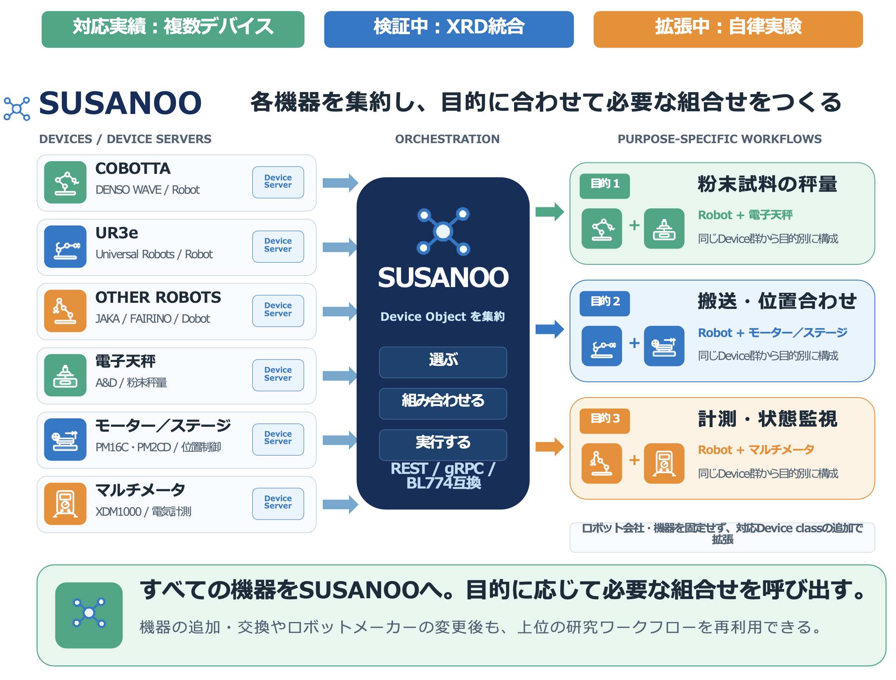
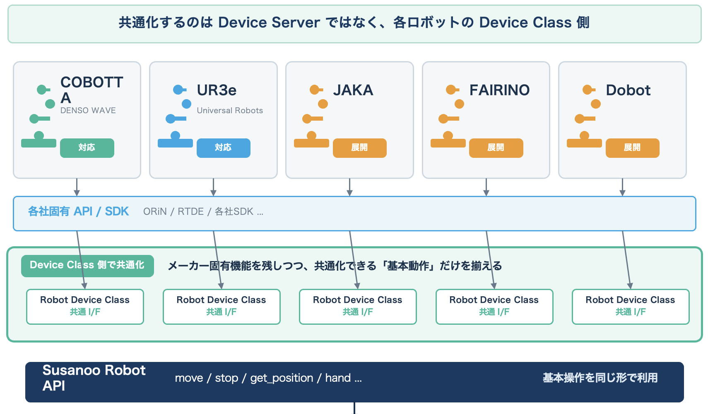

# Ohara Lab | Software {#top}
[尾原研](https://ohara.mat.shimane-u.ac.jp/) / [ohara-lab-su (github)](https://github.com/ohara-lab-su) / [ohara-lab-su (docs)](https://ohara-lab-su.github.io/)

## 更新履歴
- 2026/08/11: [コボッタ制御](#cobotta)、[ユニバーサルロボット](#ur)の記事を追加
- 2026/08/10: [n10w02 update](https://github.com/ohara-lab-su/n10w02/)
- 2026/08/10: [高速な gRPC 転送用 grpc_frame update](https://github.com/ohara-lab-su/grpc_frame/)
- 2026/08/09: [ese774_frame 動的ディスパッチ update](https://github.com/ohara-lab-su/ese774_frame/)
- 2026/08/08: [cobotta_ctrl_joypad update](https://github.com/ohara-lab-su/cobotta2/)
- 2026/08/08: [動的ディスパッチの初学者向けのセクションを追加](#transparent-proxy)
- [HISTORY](history.md)


# 対応デバイスサーバ一覧 {#device-server}
**(*) 2026/03/03 ソースコードにはアクセス制限あり**。 
以下は各機器ごとに**制御プログラム**とスサノオに対応した**デバイスサーバー**が公開されている。
そのドキュメントを以下に示す。
機器制御側は基本的に全て[スサノオ (仮)](#susanoo)とは独立して記述してあるために、
**他の機器制御フレームからでもそのまま使える**。
スサノオを使われない場合でも下記の制御クラスはぜひ使っていただければと思う。

## DeviceClass {#device-class}

- ロボット制御class: [cobotta](https://ohara-lab-su.github.io/cobotta2/) / ([source](https://github.com/ohara-lab-su/cobotta2/))
- ロボット制御class: [cobotta 文字書き](https://ohara-lab-su.github.io/glyph_motion/), ([source](https://github.com/ohara-lab-su/glyph_motion/))
- ロボット制御class: [UR (UR3e)](https://ohara-lab-su.github.io/ur/), ([source](https://github.com/ohara-lab-su/ur/))
- ロボットGUI: [cobotta_joypad (GUI)](https://ohara-lab-su.github.io/cobotta2_joypad/), ([source](https://github.com/ohara-lab-su/cobotta2_joypad/))
- 電子天秤制御class: [aandd_reader](https://ohara-lab-su.github.io/aandd_reader/), ([source](https://github.com/ohara-lab-su/aandd_reader/))
- 二次元検出機class: [MiniPIX](https://ohara-lab-su.github.io/mini_pix/), ([source](https://github.com/ohara-lab-su/mini_pix/))
- マルチメータclass: [xdm1000](https://ohara-lab-su.github.io/xdm1000/), ([source](https://github.com/ohara-lab-su/xdm1000/))
- モーター制御class: [ツジ電子 PM16C](https://ohara-lab-su.github.io/pm16c16/), ([source](https://github.com/ohara-lab-su/pm16c16/))
- モーター制御class: [ツジ電子 PM2CD](https://ohara-lab-su.github.io/pm2cd/), ([source](https://github.com/ohara-lab-su/pm2cd/))
- 画像転送class: [n10w02 (コボッタ付属カメラ)](https://ohara-lab-su.github.io/n10w02/), ([source](https://github.com/ohara-lab-su/n10w02/))
- 画像転送class: [Web cam (OpenCV を使ったカメラ)](https://ohara-lab-su.github.io/image_server/), ([source](https://github.com/ohara-lab-su/image_server/))
- 粉体の位置測定class: [powder-level-monitor](https://ohara-lab-su.github.io/powder_level_monitor/), ([source](https://github.com/ohara-lab-su/powder_level_monitor/))
- 通信Frame テスト class: dummy_device, ([source](https://github.com/ohara-lab-su/ese774_dummy/)) ese774_frame 試験用の仮想のデバイス

## Framework {#frame-work}

- 通信Frame: [ese774 frame](https://ohara-lab-su.github.io/ese774_frame/), ([source](https://github.com/ohara-lab-su/ese774_frame/)) SPring-8 BL774 互換風味
- 通信Frame: [gRPC frame](https://ohara-lab-su.github.io/grpc_frame/), ([source](https://github.com/ohara-lab-su/grpc_frame/)) 高速な gRPC 転送用
- 通信Frame: [TANGO frame](https://ohara-lab-su.github.io/tango_frame/), ([source](https://github.com/ohara-lab-su/tango_frame/)) alpha-stage
- 通信Frame: DDS frame
- ロガーclass: [x_logger](https://ohara-lab-su.github.io/x_logger/), ([source](https://github.com/ohara-lab-su/x_logger/))

## others

- メール送信サーバ: [notify_server](https://ohara-lab-su.github.io/notify_server/), ([source](https://github.com/ohara-lab-su/notify_server/))
- Web カメラ制御: [camera_control](https://github.com/shimane-dev/web_camera) Web カメラ画像を gRPC 転送するだけ (alpha stage)
- WebSocket カメラ制御: [WebSocket によるリアルタイム通信 (過去資産+次のあれこれ alpha 版)]()
- [過去資産の移行](susanoo_porting.md)

---

* Toc
{:toc}
 
# スサノオとは？ {#susanoo}
[return](#top)

島根大学が開発する、SPring-8 の **[BL774](https://user.spring8.or.jp/sp8info/?p=42759)** 互換 (ese774)
を用いた一連の計測システムを
**S**ustainable
**U**nified
**S**ystems
**A**rchitecture
for
**N**etworked
**O**perations
and
**O**rchestration
の頭文字を取り、スサノオ (SUSANOO) と読んでいる (*)。
測定・解析・可視化・判断などをトータルで扱うための、
**デバイス単位の緩やかな結合**を基本思想としている。

(*) 名前は変わる可能性がある

## スサノオの概要
[return](#top)

スサノオでは SPring-8 における [MADOCA/DARUMA](https://user.spring8.or.jp/sp8info/?p=37181) や
ESRF の [TANGO](https://www.tango-controls.org/) のようなフルスタック型のプロトコル・フレームワークを新たに構築することは目的としない。

スサノオが目指すのは、
gRPC / FastAPI (BL774 互換) などを用いた、
軽量なマイクロサービスを組み合わせるコンパクトなフレームワークである。
マイクロサービスとしてデバイスサーバーを作成し、
デバイスサーバーをデバイスオブジェクトとして組み合わせることで、
必要な機器や解析機能を緩やかに結合することを目的とするからだ。



無論、デバイスサーバー単位の構成は、
MADOCA や TANGO でも一般的なものである。
ただし、スサノオでは、
それらのような大規模なフレームワーク・共通基盤やプロトコルそのものを新たに設計することは目的としない。
スサノオでは、マイクロサービスとして作成したデバイスサーバーや解析機能を、
必要に応じて組み合わせられることのメリットを重視するからだ。

そしてスサノオでは、
ターゲットとなるデバイスと、目的に応じた通信速度・フレームワークとの結合をしやすいように、
フレームを切り替えても同じように使えるようにする。
つまり、基本は**シンプルな[透過型プロキシ](#transparent-proxy)**構成である。

同時に、スサノオは
[BL774](https://user.spring8.or.jp/sp8info/?p=42759)
互換としての立ち位置を持つ。
これは、公式に**BL774 REST server** のコードを基盤にしており、
get や post のルールを
[BL774](https://user.spring8.or.jp/sp8info/?p=42759)
側の真似をしているところである (まだ、不完全である)。
なにより、マネージメントや API セットにはまだ大きな規定や仕組みはない。
つまり 774 API セットに対応しているわけではなく、
774 Basic System 未満である。

意図的に、ユーザーレベルのマネージもアクセス権も作らない。
最大規模でも、
SPring-8 の BL 単位。
研究室のラボの機器とアクセスフリーなヤクザなユーザー構成を前提とする。

そして、基本センスとしては、スサノオはフレームワーク側として API を統一整理する代わりに、
制御クラス側に API の規定を任せている。
つまり、[透過型プロキシ](#transparent-proxy) として[動的ディスパッチ](susanoo_dynamic_dispatch.md) を軸としたフレームであり、
制御クラス側の python の API がそのままクライアント上での API となる。
API を揃える場合は制御クラス側で揃える。

これは、最初から[デバイスサーバー](#device-server) を増やす前提のもとで設計されているためであり、
デバイスごとに基本となる API が異なるためだ。
モーター系など、すでに揃えるべき API セットが固定されたものを扱うことよりも、
**多種多様なデバイスに対する対応の容易さ**の方を重視している。
言い換えると徹底的にミニマム志向で作られているともいえる。

- [方針メモ](susanoo_intro.md)

## 透過型プロキシとは？ {#transparent-proxy}
[return](#top)

スサノオでは、
デバイスへのアクセスを透過型プロキシ (Transparent Proxy) として構成している。

**プロキシ**とは、クライアントと実際のデバイスの間に入り、
通信を仲介するプログラムである。
しかし、スサノオでは単に通信を中継するだけではなく、
できるだけ元のデバイスクラスをそのまま利用できることを重視している。
つまり、利用者はネットワークの存在をほとんど意識することなく、
ローカルの Python オブジェクトを扱うような感覚でデバイスを操作できる。


スサノオ自身は、デバイス固有の API を新たに定義したり、
複雑な抽象化レイヤーを追加したりしない。
基本的にはデバイス制御クラスのメソッドをそのまま公開し、
クライアント側から呼び出せるようにするだけである。
そのため、

- 既存の制御クラスを流用しやすい
- デバイス固有の機能を失わない
- 新しい機器への対応が容易

という特徴を持つ。
もちろん、
ロボットのように複数メーカー間で共通化したい API については、
制御クラス側でインターフェースを整理することもできる。
しかし、その責務はフレームワークではなく、各デバイスライブラリ側に委ねている。
このように、
通信機構を共通化しつつ、
デバイスクラスの機能をできるだけそのまま利用できることが、
スサノオにおける[透過型プロキシ](#transparent-proxy) 構成の特徴である (*)

*) そもそも、
[BL774](https://user.spring8.or.jp/sp8info/?p=42759)
をはじめとする機器制御フレームワークでは、
ネットワークの向こうにある機器をローカルなオブジェクトに近い形で扱う、
透過的な構成が広く用いられている。
Device、**Device Class**、**Device Server** という関係と名称も一般的なものであるが、
スサノオにおけるこの名称分類は
**[TANGO](https://www.tango-controls.org/)**
の影響を強く受けている。


## 動的ディスパッチとは？
[return](#top)

スサノオでは、デバイス制御クラスのメソッドをネットワーク越しに呼び出すために、
**[動的ディスパッチ (Dynamic Dispatch)](susanoo_dynamic_dispatch.md)** を利用している。

例えば、デバイス制御クラスに

```python
device.move (...)
device.stop ()
device.get_position ()
```

というメソッドがある場合、クライアント側でもほぼ同じ形で

```python
device.move (...)
device.stop ()
device.get_position ()
```

と呼び出すことができる。
内部では、

```text
client.move (...)
        ↓
network
        ↓
server
        ↓
device.move (...)
```

のように、クライアントから送られた**メソッド名と引数**をもとに、
サーバー側が対応するデバイスクラスのメソッドを探して実行している。
通常の Web API では、`move`、`stop`、`get_position` などの処理ごとに
個別の API を定義する必要がある。
[動的ディスパッチ](susanoo_dynamic_dispatch.md) を利用すると、
制御クラスにあるメソッドを比較的そのまま公開できるため、
新しい機器や新しい機能を追加するときの通信部分の記述を大幅に減らすことができる。

これはスサノオの
**[透過型プロキシ](#transparent-proxy)**
を実現するための基本的な仕組みの一つである。
つまり、
**制御クラス側の Python API を、できるだけそのままネットワーク越しの API として利用する**
という考え方である。

スサノオでは、当初は Pydantic/OpenAPI を用いて API の I/F を明示的に定義する方式を用いていた。
しかし実際に運用すると、制御クラス側に Python API がすでに存在するにもかかわらず、
通信側にも同じ I/F を定義して維持する必要があり、多種多様なデバイスを追加していく上では面倒であった。
そのため現在は、**DeviceClass の Python API をそのまま I/F とする完全な動的ディスパッチを基本**としている。

一方、動的ディスパッチだけでは、
利用できるメソッドや引数の型などの I/F が外部から分かりにくい。
そのため、Pydantic/OpenAPI を用いた明示的な API 定義も残しており、
OpenAPI による I/F が必要な場合には選択して利用できる。

より詳しい仕組みと Pydantic/OpenAPI との関係については、
[動的ディスパッチと API の定義](susanoo_dynamic_dispatch.md)
に記す。


## ロボット制御
[return](#top)

特にスサノオ (仮) の自動化の中核として、ロボット制御のデバイスサーバーが挙げられる。
当然ロボットに関しては各社独自のフレームワークなど、大変な力を入れている。
それらを置換するものではない。
各社のロボットは、ハードウェアとしての目的が異なるために I/F の違いが大きい.
スサノオではこれらをある程度統一的な API-I/F として揃える。
つまり各社 API の緩やかな抽象化を行う。
各社を横断した API セットは、メーカーではできない、大学らしい設計となる。
各社の違いを超えて、実験する人が容易に置き換えることを目的としている。



### デンソーウェーブcobotta {#cobotta}
[return](#top)

デンソーウェーブのロボットでは、
コントローラ内部の Motion Generator / Robot Motion が実際のモーション制御を担い、
その上位に PacScript、ORiN2、b-CAP などの制御 I/F が用意されている。

TP や WINCAPS から作成する通常のロボットプログラムは、
デンソーウェーブ独自のロボット言語である PacScript としてコントローラ上で実行される。
一方、PC からは ORiN2 を介して制御できるほか、
より低レベルには b-CAP を直接利用してコントローラへアクセスすることもできる。

ORiN2 はロボットを含む各種デバイスを共通のオブジェクトとして扱うためのフレームワークであり、
Provider を介して各デバイスへ接続する。
RC8 への通信ではその下位で b-CAP が利用されるため、
ORiN2 は上位のデバイス抽象化、
b-CAP はコントローラへアクセスする通信プロトコルという関係になる。

- [スサノオにおける COBOTTA 制御の詳細](https://ohara-lab-su.github.io/cobotta2/)

### ユニバーサルロボット {#ur}
[return](#top)

Universal Robots のロボットは、
Robot Arm、Control Box、
Teach Pendant から構成される。
実際に各関節を協調して動かす制御の中心は Control Box 側にあり、
TP 上の **PolyScope** はその上位にある操作・教示・プログラミング環境である。
PolyScope で作成したロボットプログラムや外部 PC から送信した URScript は、
最終的に Control Box 側の URControl で実行され、ロボット動作へ変換される。

外部 PC との通信には Universal Robots 公式の
**RTDE**、
**Primary / Secondary Interface**、
**Dashboard Server** など複数の I/F が用意されている。
このうち RTDE は、外部 PC と UR controller の間で controller の状態、
I/O、汎用レジスタなどを双方向に読み書きする公式 I/F である。
ただし **RTDE** 自体に `movej` や `movel` のようなロボット動作命令が定義されているわけではない。
**RTDE** で渡した値をどの動作に使うかは、必要に応じて controller 側のロボットプログラムが受け持つ。

現在スサノオで使用している `RTDEControlInterface` は Universal Robots 純正 API ではない。
これは **SDU Robotics** が開発するオープンソースライブラリ `ur_rtde` の API であり、
Universal Robots 公式 **RTDE** とロボット側で動作する **control URScript** を組み合わせ、
PC から `moveJ`、`moveL`、`servoJ` などを呼べる形にまとめたものである。
したがって、Universal Robots 公式の RTDE と SDU Robotics の `ur_rtde` は明確に区別して扱う必要がある。

現在の実装では、
モーション制御に SDU Robotics の `RTDEControlInterface`、
状態取得に `RTDEReceiveInterface`、
I/O に `RTDEIOInterface`、
コントローラ管理に Dashboard Server、
controller message / error の取得に Primary Interface を利用している。

- [Universal Robots の制御アーキテクチャ](robo_ur_control_architecture.md)
- [公式 RTDE と SDU Robotics `ur_rtde`](robo_ur_rtde_control.md)

### JAKA

JAKA の協働ロボットでは、
Robot Arm と Controller が実際のモーション制御を担い、
その上位に JAKA App による教示・操作、
Controller 上で実行するロボットプログラム、
外部 PC 用の公式 SDK / 通信 I/F が用意されている。
外部 PC からは C/C++、C#、**Python の公式 SDK** を利用でき、
**V3 Controller** では gRPC の利用が推奨されている。一方、TCP/IP 外部制御プロトコルも公開されており、Controller の状態取得や制御を独自に実装することも可能である。

公式 GitHub では SDK や ROS / ROS2 関連資産も公開されている。
ただし Python SDK は `jkrc` とメーカー提供の native library を利用する構成であり、
公開 GitHub repository が存在することと、
SDK 全体が純粋な OSS であることは分けて考える必要がある。

* [JAKA の制御アーキテクチャ・SDK・通信 I/F の詳細](robo_jaka_control.html)

### FAIRINO

FAIRINO の協働ロボットでは、Robot Arm と Control Box がモーション制御を担い、WebAPP / Teach Pendant が教示・操作環境となる。Controller 上のロボットプログラムには Lua が用いられ、これとは別に外部 PC から公式 SDK を用いて Joint / Cartesian motion、Jog、Servo motion、I/O、状態取得などを直接操作できる。

Python、C++、C#、Java の公式 SDK が GitHub で公開されており、Python SDK は Apache-2.0 で公開されている。このため Python から独自の制御 class を構築する場合、第三者 wrapper を必須とせず、メーカー公式 SDK をそのまま基盤として利用しやすい。

* [FAIRINO の制御アーキテクチャ・SDK・通信 I/F の詳細](robo_fairino_control.html)

### Dobot

Dobot の CR / CRA 系協働ロボットでは、
Robot Arm と Controller がモーション制御を担い、
DobotStudio Pro が教示・操作・プログラミング環境となる。
外部 PC 制御では Controller の TCP/IP protocol が公開されており、
管理 command、motion command、real-time feedback などが異なる通信経路として整理されている。

公式 GitHub では TCP/IP protocol を Python から利用する `TCP-IP-Python-V3` が
MIT License で公開されているほか、
ROS / ROS2 関連資産も公開されている。
このため通信 protocol から Python 制御 class まで追いやすく、
独自のデバイス制御層を構築しやすい構成である。

* [Dobot の制御アーキテクチャ・SDK・通信 I/F の詳細](robo_dobot_control.html)

### FANATIC
FANATICのスサノオでの制御アレコレ

...

## デバイスサーバー単位の緩やかな結合
[return](#top)

自動化・自律化などの大きな枠組みを作らずに、
あくまでデバイスサーバー単位での緩やかなシステム構成を中心に据えるのがスサノオ (仮) である。
それはフィジカル AI 時代に対する一つの回答であるのは言うまでもない。

どのような汎用 API を用意して、どのような大きな構成を見据えた巨大なフレームワークを作っても、
最終的には AI による命令・実行に置き換わることは、目に見えて明らかであるからだ。

その時に残るシステムバックエンドは、
保守メンテナンスに優れたデバイス単位のミニマムな構成である。
インテリジェントな構成はその上位に任せれば良い。

上位の実験シーケンスや知能化の手法は今後も変化していく。
一方で、長く利用されるのは、保守性に優れたデバイス単位のコンポーネントである。
スサノオでは、そのような下位レイヤーをできるだけシンプルに保ち、
上位の知能化や自動化は利用者が自由に構築できるようにする。

## 解析との結合による自動・自律実験
[return](#top)

スサノオ (仮) では、それぞれのデバイスが分散環境に配置されていても、
利用者はネットワークを意識することなく扱うことができる。
つまり、ハードウェアは利用者から見れば、ただのデバイスオブジェクトである。

これは何を意味するか？

デバイスオブジェクトを、
解析用のプログラム・オブジェクトと同じように扱い、
互いに組み合わせることができるということである。

測定を行うデバイスオブジェクトと、
解析、可視化、判断を行うプログラム・オブジェクトを緩やかに結合することで、
測定結果を解析し、その結果から次の動作や測定条件を決定する、
自律的な自動実験へ容易に展開することができる。

巨大なフレームワークは、その時代の技術や要求に強く依存し、
一度構築しても短期間で陳腐化する。
また、フレームワークが巨大になればなるほど、
継続的な維持、刷新、移行に必要なコストも莫大になる。

自動実験・自律実験に必要な資産を継続的に維持・蓄積し、
時代に応じて更新していくためには、
個々の機能を小さな単位で作り、
分散したオブジェクトとして緩やかに結合できることが重要である。

このようなマイクロな設計と、
分散したオブジェクトの緩やかな結合が、本プロジェクトの目的である。


# 分散システムとは？
[return](#top)

スサノオでは [MADOCA/DARUMA](https://user.spring8.or.jp/sp8info/?p=37181) や
[TANGO](https://www.tango-controls.org/)
のような本当の意味での分散システムは目指さない。
つまりサーバー・サーバー間通信を前提とした意味での分散ではなく、
単純なサーバー・クライアント通信をベースとしたシステム構成とする。
ミニマムな実験支援系システムではそれほど本格的な分散システムは必要ないという判断が根底にあるからだ。
単純に [BL774](https://user.spring8.or.jp/sp8info/?p=42759)
型の互換であるからという理由もあるし、
設計・開発・保守メンテナンスをミニマムなコストで行うためである。

1. [機器制御における分散モデル](susanoo_dcs_intro.md), 分散モデルの基本概念
2. [分散ノード通信の基盤](susanoo_dcs_com.md), ソケットパターン分類 (BL774, TANGO, MADOCA/DARUMA, ROS2)

## スサノオにおける分散システム
[return](#top)

- [スサノオのシステム](susanoo_system.md)

[BL774](https://user.spring8.or.jp/sp8info/?p=42759)
はメインとしては REST API を採用している。
これは大変遅い通信である。
しかし、Web に立脚した技術体系の普及率と裾の広さ、簡便さは捨てがたく、
REST API に立脚することは、遅い機器制御においてはそれほど間違っていない。
開発効率と一般的で普及しているシステムであることは何より大切である。
同システムのサブセットであるスサノオも同等である。


それに対して、
それなりに高速な通信やイベント起動などの高度な通信が必要な場合も存在する。
この場合は、
[MADOCA/DARUMA](https://user.spring8.or.jp/sp8info/?p=37181) や
[TANGO](https://www.tango-controls.org/) のような
ZMQ ベースの通信が圧倒的に有利になってしまうが、
同じ Web 技術の範囲でも gRPC ならば、バイナリ通信であり、選択肢としてそれほど悪くない。
(実はデンソーウェーブの ORiN3 でも gRPC に進んだのは、採用は遅いにしても、ある意味トレンドを彼らなりに
追いかけた結果と評価できなくもない)
そのような gRPC を Web 通信のカテゴリの一種として、スサノオでは選択可能になっている。
この gRPC への拡張は本家 BL774 でも行われており、
BL774 対応の一つでもある。

分散環境というチョイスでは、世界的標準になりつつあるのが DDS であり、
最初から DDS ベースで設計するというのは一つの手段として正解である気もしないでもない。
その視点で最初から DDS ベースで作ったものが、
ロボットベースでよく使われる、
ROS2 というフレームワークである。

Web ベースであるか？DDS のような本格的な分散ベースか？の選択肢となるが、
スサノオでは BL774 ベースであるため、DDS ベースはとりあえずはコアライブラリとしては除外する。
DDS との接続はロボットを使う上では必須であるため、枠組みに入れていく形にする。

---

# スサノオの設計思想のまとめ

スサノオは、DeviceClass ベースのシンプルな構成を基本としている。

その基本単位は、特定の Framework や通信 protocol に依存しない、個別の機器制御 class である。
ある意味、スサノオそのものは Framework ですらない。

各機器制御 class は単独で利用でき、ネットワーク越しの利用が必要な場合にのみ、REST や gRPC などの薄い通信層を付加する。
通信層は交換可能であり、機器制御 class 自体は特定の通信方式に依存しない。

この薄い通信層を介して、複数の DeviceClass をデバイスオブジェクトとして必要に応じて連携させる。
また、ロボット API のように明確な目的がある場合を除き、Framework 側で API を統一することも基本的には行わない。

---

# デバイスオブジェクト {#device-object}
[return](#top)

## インストール方法

スサノオを構成する基本モジュールを導入する

- [スサノオの基本構成のインストール](susanoo_install.md)

次に[デバイスサーバー](#device-server) を導入する必要がある。 
後述する、すでに開発済みのデバイスサーバーを使うだけならば次のセクションは飛ばして良い。

## デバイスサーバー作成 (自動ディスパッチ)
[return](#top)

スサノオは透過型の Framework を基盤としており、FastAPI (BL774 型) や gRPC を用いた透過型プロキシを使ったデバイスサーバーを作ることができる。
ここではローカルで動作するデバイスオブジェクトから、サーバー・クライアントで動作するデバイスオブジェクトの作り方まで説明する。

スサノオは、サーバー・クライアント型のシンプルな分散システムである。
そのため、使用するにあたっては、デバイスサーバーの形でデバイス (実験機器) 側のサーバーを立ち上げる必要がある。
スサノオはほぼ完全な[透過型プロキシ](#transparent-proxy) であるため、
基本は制御クラス (デバイスクラス) があればデバイスサーバー・クライアント作成はほぼ終わる。

1. スサノオに関係なく[デバイス制御クラス (プログラム)](#device-class) を書く。
2. スサノオフレームを用いて、デバイス制御クラスからデバイスサーバーを作る (**わずか数行**)
3. サーバー側で処理されてしまう処理をクライアント側にしたいなど (たとえばファイル保存) の例外処理を書く
4. スサノオフレームにより自動で作られるデバイスプロキシ (デバイスクライアント) を用いて、実験制御プログラムを書く。

クライアントサーバーで例外処理がない場合は、実質的には最初の 1 のステップだけで、
デバイスサーバー公開までのステップはほぼ終わる。

4 の作業をより簡略化するために、1 をうまく作ると良い。
すでに我々が用意しているものはこの後のセクションにある。
これらの具体的作業を下記に記す。

...

## デバイスサーバー作成 (Pydantic/OpenAPI タイプ)
[return](#top)

現在のスサノオでは、[動的ディスパッチ](#動的ディスパッチとは) により
DeviceClass の Python API をそのままネットワーク越しに利用する方式を基本としている。

一方で、Pydantic を用いて API 定義を記述することで、OpenAPI に対応した I/F 定義を作ることもできる。
この方式では、透過型プロキシとしての完全自動のメリットはなくなり、
DeviceClass 側の Python API とは別に I/F 定義を記述する必要がある。
その代わり、OpenAPI による定義を提供できるため、幅広い Web 技術との連結がしやすい。

そのため、現在は **Pydantic/OpenAPI による明示的な I/F が必要な場合に利用する方式**としている。

1. スサノオに関係なく[デバイス制御クラス (プログラム)](#device-class) を書く。
2. スサノオフレームを用いて、デバイス制御クラスからデバイスサーバーを作る
3. スサノオフレームを用いて、デバイスサーバーの**API 定義**を記述する
   Pydantic/OpenAPI という一般的な Web 技術とその記法で記述されており、スサノオが用意するクライアントを使わなくてもデバイスサーバーを使うことができる
4. サーバー側で処理されてしまう処理をクライアント側にしたいなど (たとえばファイル保存) の例外処理を書く
5. スサノオフレームにより自動で作られるデバイスプロキシ (デバイスクライアント) を用いて、実験制御プログラムを書く。

この方式では 3 の API 定義が必要になる。
通常の完全な動的ディスパッチではこの定義を省略でき、
DeviceClass があればデバイスサーバー・クライアントをほぼそのまま作ることができる。
一方、OpenAPI として I/F を外部へ明示したい場合には、この方式を利用する。

- [スサノオに対応するデバイスサーバの作成](susanoo_device_server.md) (自分でデバイスサーバーを作る場合)

実際にデバイスサーバーを作る例を下記に示す。
すでにデバイスクラス (機器制御用のクラス) が存在するときに、デバイスサーバーまでを作る例である。

- [cobotta 制御サーバ (ese774)](https://ohara-lab-su.github.io/cobotta2/tutorials/install_server.html) の導入
- [cobotta 制御クライアント (ese774)](https://ohara-lab-su.github.io/cobotta2/tutorials/install_client.html) 導入
- [電子天秤サーバ (ese774)](https://ohara-lab-su.github.io/aandd_reader/tutorials/intro.html#a-ese774) の導入
- [電子天秤クライアント (ese774)](https://ohara-lab-su.github.io/aandd_reader/tutorials/intro.html#a-ese774) の導入

クライアントコードは async 対応であるが、厳密にはサーバー側の制御クラスが非同期に正しく対応していないと
唯のハッタリ async となる。
もともとサーバーとクライアントで分離しているために、
同期非同期はそれぞれの責務となる。
クライアント側の責務は async と sync には正しく対応している。
問題はサーバ側、つまり機器側の対応になる。
つまり、async で非同期並行処理っぽく見せていて、
サーバー側はコテコテのマルチスレッドやマルチプロセスで、非同期並列処理となっている場合がありうる。
注意が必要である。この非同期性の担保・実装は個別の**デバイスサーバーの責務**となる。
原理的に不可能なデバイスも多い。


## 実験用サンプルスクリプトと環境構築 docs
[return](#top)
**(*) 研究室の学生向けのドキュメント**

実験制御をするエンドユーザーにとって簡便であること。これがスサノオの究極的な目的である。
スサノオ使用者は、ロボット制御や通信の複雑なプログラムを書く必要も、理解する必要もない。
Python は多少は知っておく必要がある。

おそらく、学生にとっては cobotta やスサノオのシステムの導入より、
サーバーPC と python 環境などの環境構築が大変な障壁になる。
以下に学生の試行錯誤の記録を記す

<a href="https://w1769571594-yzx230902.slack.com/archives/C0AJHG8VBA5/">

</a> [Ohara Lab Slack Robo Channel](https://w1769571594-yzx230902.slack.com/archives/C0AJHG8VBA5/)

- [簡単なシーケンススクリプト例](susanoo_robo.md)
- [学生が書いた学生向けドキュメント (研究室内部 doc)](https://github.com/shimane-dev/docs/tree/main/cobotta_setup/ohara_lab.md)
- [学生が書いた学生向けドキュメント (公開を目指している途中 doc)](https://github.com/shimane-dev/docs/tree/main/cobotta_setup/cobotta_setup.md)

<!--

-->

<div align="center">
<span style="padding:0 20px;">●</span>
</div>


# 計算・解析オブジェクト


実験制御たるデバイスサーバー（デバイスクラス）と連携する計算・解析オブジェクトを提供する

## 計算・データ解析 (RMC): source
[return](#top)
**(*) 2026/03/03 アクセス制限あり**

主に逆モンテカルロ (RMC) を用いた計算・データ解析とそのための支援ツールなど。

- [Packmol_util](https://ohara-lab-su.github.io/packmol_util/) / ([source](https://github.com/ohara-lab-su/packmol_util/)) 非晶質の構造作成
- RMC (FNC) 形状固定の方法 / ([支援ライブラリ](https://github.com/ohara-lab-su/rmc_dft/tree/main/src/rmc_dft/rmc_pot))
- RMC (TOP) ポテンシャル利用 / ([支援ライブラリ](https://github.com/ohara-lab-su/rmc_dft/tree/main/src/rmc_dft/rmc_pot))
- [RMC (SNC) Qn Network](https://ohara-lab-su.github.io/qn/) / ([source](https://github.com/ohara-lab-su/qn/)) RMC_POT 用の Qn network 作成支援
- RMC (ANN) 機械学習ポテンシャル利用 (AENET の ANN ポテンシャル) / ([支援ライブラリ](https://github.com/ohara-lab-su/ann_env)) ANN 作成/利用 支援ライブラリ
- [RMC-DFT](https://ohara-lab-su.github.io/rmc_dft/) / ([source](https://github.com/ohara-lab-su/rmc_dft/)) RMC/DFT に関するクラスライブラリと RMC-DFT 計算コード
  - [RMC-DFT: RMC 支援クラスライブラリ](https://github.com/ohara-lab-su/rmc_dft/tree/main/src/rmc_dft/rmc_pot)
  - [RMC_DFT: VASP 支援クラスライブラリ](https://github.com/ohara-lab-su/rmc_dft/tree/main/src/rmc_dft/vasp)
  - RMC-DFT: QE (Quantum ESPRESSO) 支援クラスライブラリ
- [RMC-MLP: ACE](https://ohara-lab-su.github.io/ace_env/), ACE を MD/DFT の代わりに使うための支援
- [RMC-MLP: GAP](https://ohara-lab-su.github.io/gap_env/), MLP を MD/DFT の代わりに使うための支援。苦労の割には報われない気がする。それよりは、RMC の制約・補正としての ANN が RMC
- RMC-MD: LAMMPS
- [webPDF の Rust 版（パラメータ自動調整版)](https://ohara-lab-su.github.io/rust_pdf/web/) / ([source](https://github.com/ohara-lab-su/rust_pdf/))
- [webPDF local](https://github.com/kengo-nakada/local_pdf) 廃止予定/Rust 版へ統合


## 計算・データ解析 (MD): source
[return](#top)
**(*) 2026/03/03 アクセス制限あり**

主に古典分子動力学 (MD) を用いた計算・データ解析とそのための支援ツールなど

- [Power スペクトル (using lammps トラジェクトリ) 計算コード](https://github.com/kengo-nakada/md_analysis) MD 解析支援 project
- [lammps to vasp](https://github.com/shimane-dev/lammps_to_vasp)
- LAMMPS の基本的な使い方

## 計算・データ解析 (MLP): source
[return](#top) **(*) 2026/03/03 アクセス制限あり**

主に機械学習ポテンシャル (MLP) を用いた計算・データ解析とそのための支援ツールなど

- [機械学習ポテンシャル ACE](https://github.com/kengo-nakada/ace_env) (非晶質にはちょっと学習向いてないかも)
- 機械学習ポテンシャル SNAP
- 機械学習ポテンシャル GAP (割と本命)

## 計算・データ解析 (DFT): source
[return](#top)
**(*) 2026/03/03 アクセス制限あり**

主に密度汎関数理論 (DFT) / 第一原理 MD を用いた計算・データ解析とそのための支援ツールなど

- [x_poscar](https://github.com/shimane-dev/x_poscar) VASP 構造と Bader 電荷密度と MD 関係の解析支援クラスライブラリおよびその使用例
- [周波数解析](https://github.com/shimane-dev/x_frequency) ゼロクロッシング法による周波数推定と Synchrosqueezing Transform (SST) による周波数セグメント検出
- [COHP による結合解析](https://github.com/shimane-dev/x_lobster)
- ワニエ関数による局在化軌道解析 (結合解析)
- ワニエ関数による局在化軌道解析 (電荷のずれ)
- [SAE](https://github.com/shimane-dev/sae) DFT 計算と結晶構造と群論に関して支援ツール集 (**古すぎるのでほぼ死亡** 歴史的役割は終わった)
- [vasp1](https://github.com/shimane-dev/vasp1) VASP 支援スクリプト集
- [bader1](https://github.com/shimane-dev/bader1) Bader 支援スクリプト集
- [真空層 関連ツール](https://github.com/shimane-dev/change_lattice_constant)
- [構造の結合 ツール](https://github.com/shimane-dev/merge_cells)
- [rotate クラスター](https://github.com/shimane-dev/rotate_cluster) クラスター回転
- [VCA (仮想結晶近似)](https://github.com/shimane-dev/make_vca) 仮想結晶近似
- [SQS を用いた構造作成・計算](https://github.com/kengo-nakada/make_sqs)
- [表面構造作成支援 (突貫)](https://github.com/shimane-dev/make_surface)


- [全電子計算手法 (FLAPW) による DFT 計算手法開発](https://github.com/kengo-nakada/flapw) (HiLAPW 基盤から、FLEUR/exting 基盤へ移行中)
- VASP の基本的な使い方
- QE の基本的な使い方
- キュリー温度の計算コード開発


# 過去記事
[return](#top)

計算手法の基礎とその応用についての過去記事

- [第一原理計算の基礎知識](abinit/intro/intro.md)
- [第一原理計算の選び方 (プレゼン資料)](https://support.spring8.or.jp/Doc_workshop/PDF_20150728/5.nakada.pdf), 2015 年度版
- [実空間差分法による XANES スペクトル計算の方法](https://support.spring8.or.jp/assets/materials/20230309_1.koide.pdf), 2023 年度版
- [実習](https://support.spring8.or.jp/assets/materials/190228_5.nakada.pdf)
- [TSPACE](abinit/TSPACE/tspace_00.md), 空間群のプログラム (2017)
- [memo WIEN2k](abinit/pdf/memo_WIEN2k_code_intro_2015.pdf), WIEN2k メモ (2015)
- [memo CP2K](abinit/pdf/memo_CP2k_2015.pdf), CP2K memo (2015)
- [memo PWScf](abinit/pdf/memo_PWScf_2015.pdf), PWScf memo (2015)
- [memo OpenMX](abinit/pdf/memo_OpenMX_2015.pdf), OpenMX memo (2015)
- [memo LOBSTER_COHP](abinit/pdf/memo_LOBSTER_COHP_2017.06.13.pdf), LOBSTER COHP 解析 (2017)
- [memo ELF (vasp)](abinit/pdf/VASP_ELF_2017.08.21update.pdf), ELF 解析メモ (2017)
- [遍歴電子モデルによる強磁性発現機構](abinit/pdf/20060726.pdf), M.SHIMIZU, Proc. Phys. Soc., 84 (1964) 397. の解説

## 古い記事へのリンク
[return](#top)

- [DARUMA project](http://daruma.spring8.or.jp/) (2019.12 プロジェクト更新は無くなりました。その時点でのプロジェクト内容)
- [計算関係の役立ちリンク](abinit/index.md)

---

# 主な開発者

1. K.Ohara
2. K.Kobayashi
3. K.Watanabe
4. R.Hinohara
5. K.Nakada
