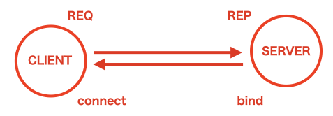
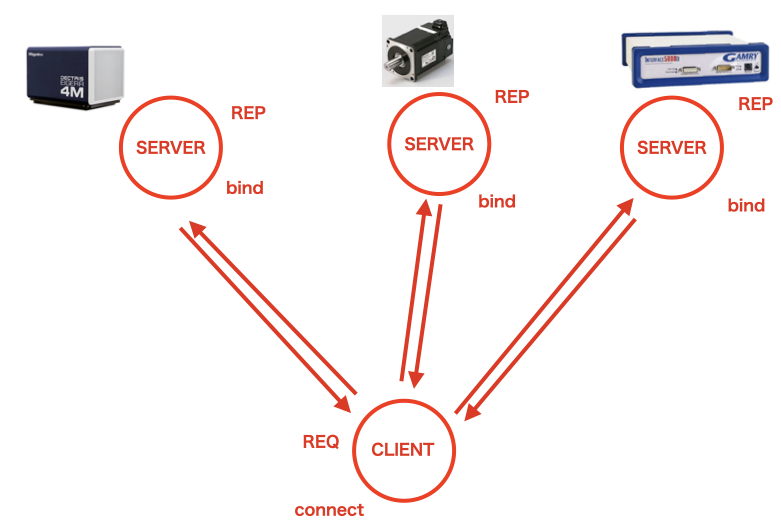
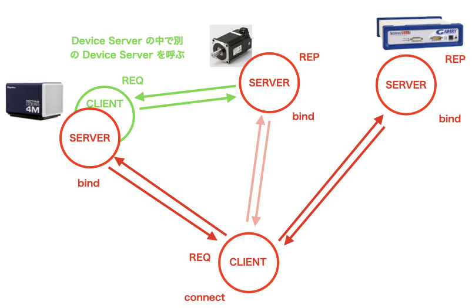
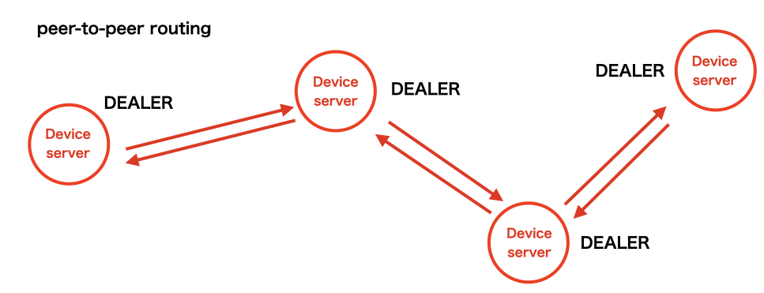
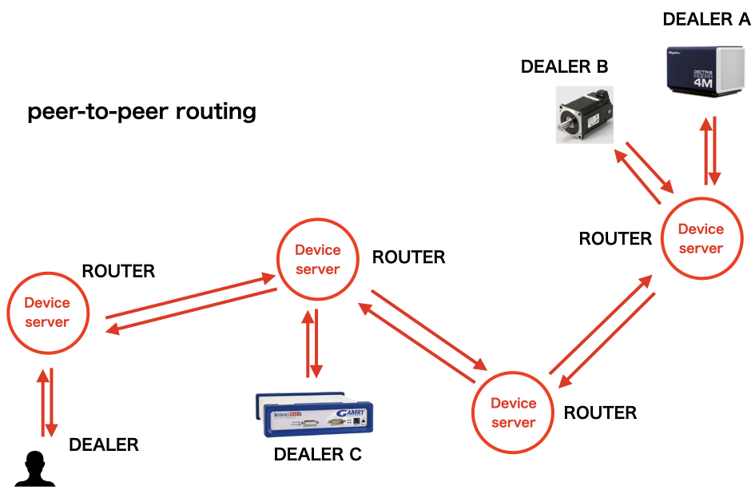

# 分散ノード通信の基礎

サーバー・クライアント通信と、サーバー・サーバー間通信を分けて理解するよりもこれらを総括して、
「ノード間通信」としてまとめて、ノード間通信のモデルとして理解した方が理解しやすい。
結局は通信は低次元で見ればソケット通信でしかない。そして、その単位で見れば
bind / connect される関係がサーバークライアントになるだけ。
あえていうならば局所的に見れば全てサーバークライアントになる。
そのソケットをパターン分類すると通信が見えてくる。

(*) 筆者は情報の専門家ではないので、用途を含めて勘違いと間違いがあるかもしれない。

## ソケットのパターン分類

[MADOCA/DARUMA](https://user.spring8.or.jp/sp8info/?p=37181) や
[TANGO](https://www.tango-controls.org/) ではソケットレベルから
コードを書くことがあるので、ZMQ ベースから入るとこれらはわりと
自然に身につくかもしれない。ZMQ は軽量コンパクトで超高速な通信用のライブラリであり、
あるいみほとんど素のsocket通信ライブラリである。
これにより通信パターンを理解することは割と行われている。

ソケットの通信パターンは大きく、REQ/REP, ROUTER/DEALER, PUB/SUB,
に分かれる。 Web 通信は REQ/REP、ZMQ を使っていると ROUTER / DEALER 
が割と基本となる。今時の MQTT や DDS では PUB/SUB 形が主体になる。
いわゆる分散プロトコルは一般には ROUTER/DEALER や PUB/SUB を使うことを指す。

また通信パターンの別問題として、同期・非同期問題を意識しておいた方がいい。
同期非同期性でいえば、web (http) は REQ / REP なので論理的には同期通信となる。
だが、実装としては非同期にREQ流れるので、一概に同期通信と言い切れないとこもある。
また、たとえば、放射光設備で言えば、MADOCA2 はフルにZMQ構成であり非同期通信である。
TANGO は v9 までは ZMQ + CORBA(同期通信)構成であり、
実はctrl message は CORBA基盤なので同期通信になる。
V10 以降は ZMQ構成でctrl messageは非同期通信である。

以下、パターン分離は全て ZMQ の言葉で全ての通信を整理する。

### 1:1 通信 REQ / REP (最小の通信)

最初に双方向メッセージの基本を抑える必要がある。たとえば、
一番身近な通信である(BL774の通信である) http などの web 通信は、
ソケットのレベルで見れば req(client) / rep(server)
モデルに相当する。

パターンとしては

#### REQ (クライアント側)

- REQ
  - send -> recv
  - request を送って reply を受け取る
 
#### REP (サーバ側)

- REP
  - recv -> send
  - request を受け取って reply を返す
 
押さえておいて欲しいのは、web 通信(http)は、
非対称構造(接続主体がclinetで応答主体がサーバー)
なので、二つノードは対等の1:1通信にならない。
その意味で典型的な意味で、サーバークライアントになる。




受ける側と (bin)、接続する側 (connect) の関係と、REQ/REP の関係を
整理するとサーバーと通信の受送信の関係を混ぜこぜにすることが減る。

- 物理層（接続）: どちらが待ち受け（Bind）、どちらが接続（Connect）するか
- 論理層（通信）: どちらが先に話しかけ、どう応答するか（REQ/REP）

これを一定レベルで理解していると。通信が見えてくる。
ZMQの面白い（そして混乱する）ところは

- REP（サーバー）が Connect してもいい
- REQ（クライアント）が Bindしてもいい
 
という柔軟性にある。つまり**接続の向きとデータの向きは独立している**

これらにもづいて、サーバー・サーバー間通信について整理すると
HTTP は req/rep 型プロトコルであり、
サーバー同士を直接つなぐ分散通信プロトコルではない。
無論、「サーバー/サービス」の機能として、
クライアントとサーバーを入れ替えて別のサーバーと通信で繋がることはできる。
たとえば、webサーバーからアクションされてから呼び出された サービス
APIが呼び出して、別のサーバーにアクセスするなど。



そこまでしなくても複数のデバイス用のサーバーをつかって、
個別のデバイスごとのサーバーへクライアントから繋がる形にする。
これが、**BL774 や スサノオの基本モデル**ではある。

TANGO のデバイスサーバモデルも、
MADOCA のような多段の routing ネットワークを前提とした構造ではない。
そのため通信モデルとして見ると、
1つのクライアントに対して複数のデバイスサーバが直接接続される
REQ/REP 型の集合として理解することもできる。

ただ、REQ/REP で作られたサーバークライアントの集合は分散通信か？
といえば、人によってはおそらく物言いが多くつくとは思う。
また、似ていることで、nginxとかでリバースプロキシをかけてweb通信を別のサーバーに
飛ばすことができるが、これも分散通信か？といえば明らかに違う。



無論デバイス間の通信はそれぞれ REQ/REP の役割が入れ替わるだけなので
いちいちユーザーの制御クライアントまで変えることはない。
その意味では比較的実用的なモデルなのだ。
無論、本質的にノード間通信を考慮されているプロトコルではないため、
デバイスサーバー間で独立的に通信するようにするのは、
途中でクライアントからの横槍的なアクセスの可能性があるため、
サーバーの設計上複雑な作りにしてやりくりする必要がある。
結局はプロトコルを高度なものにするか？実装を高度にするか？運用を高度にするか？(逆に運用をシンプルに限定してしまうか？）になる

以下はプロトコルそれ自体を分散向けのプロトコルを使った場合をまとめていきたい。

### 多重化された 1:1 通信 ROUTER / DEALER (多重化)

REQ/REP モデルは最も基本的な通信パターンである。
ただし構造としては**1つの request に対して 1つの reply**
というかなり厳密な通信シーケンスを持っている。

そのためこのモデルでは

- 複数ノードから同時に接続する
- ノード間でメッセージを転送する
- 非同期的に通信を多重化する

といった用途にはあまり向いていないとがある。

つまり、REQ/REP は 最小の通信モデルとしては非常に分かりやすいが、
分散ノード通信としては少し機能が足りない。
この制約を緩和するために ZMQ では REQ/REP を拡張した通信パターンとして

**ROUTER/DEALER**

という通信パターン（それに対応するソケット)が用意されている。

ROUTER/DEALER は基本的には REQ/REP と同じく
メッセージの往復通信を行うモデルであるが、
REQ/REP と違い

- 複数ノードからの接続を同時に扱える
- 接続ノードを識別してメッセージを転送できる
- 非同期通信が可能

である

そのため ROUTER/DEALER は
単純なクライアント・サーバ通信というよりは、

**ノード間のメッセージルーティング**

を行う通信パターンとしてよく利用される。
つまり分散通信の本丸に使われる。
次からは、もう少し具体的な例を挙げる。
Aつのコネクション(３つのノードからのコネクション)
があるとする。

```text
TCP connection A ──┐
TCP connection B ──┼── ROUTER socket
TCP connection C ──┘
```
この場合は 3:1 接続になる。
しかしこの場合でも、同時にメッセージを送ることはできない。
あくまでメッセージのシーケンスで送り、その通信自体はそれぞれの非同期で動作する形となる。

```text
(node A) ─ DEALER ─┐
(node B) ─ DEALER ─┼── ROUTER socket
(node C) ─ DEALER ─┘
```
ROUTER ソケットはそれぞれの DEALER からの接続(peer)に routing id を持っている。
raw-level でみればそれぞれのpeer ごとにソケットがあり、
それが一つの router ソケットと繋がる形になる。

つまり、物理的には1つのポートに複数の相手が繋がっているが、
メッセージに routing idという封筒を被せることで、
論理的な1:1通信を大量に詰め込んでいる状態（マルチプレクス）
になる。

そして、ROUTER は名前の通り routing をするもので「別のノード」へ送る。
これにより、別のノードのDEALER へ送ることができる

```text
(node A) ─ DEALER ─┐           ┌─ DEALER ─ (node D)
(node B) ─ DEALER ─┼── ROUTER ─┼─ DEALER ─ (node E)
(node C) ─ DEALER ─┘           └─ DEALER ─ (node F)
```
これは中央にROUTERが一つあって、そのセンターのROUTERが、
どのDEALERにメッセージを送るか？という中央集権型の DEALER/ROUTER の使い方になる。



一方、SPring-8 の MADOCA では
ノードを跨いで術繋ぎで routing できるようになっており、
中央 ROUTER は存在しない設計になっている。つまり
```text
(node A) DEALER ─ (node B) ROUTER ─ (node C) ROUTER ─ (node E) DEALER
```
のように、各メッセージサーバーが ROUTER を持ち、
そのサーバープロセスが次に送る先を決めながら
メッセージをホップさせていく peer-to-peer routing 構造となる。
ROUTER / DEALER ソケットの組み合わせで、
自由にネットワーク間通信を横断できるようになる。



ROUTER に対してデバイス（DEALER）がぶら下がり、
ROUTER 同士が接続されることで、
遠くのネットワークの装置へメッセージをホップさせながら到達する構造になる。
そして、これは非同期で繋がる。
MADOCA ではデバイス装置のサーバー機能は EM (Equiptment manger) 
読んでいて、これは ZMQ のなかでは装置側の DELAER に相当する。
ROUTRE の MS (Message Server) とは区別している。
TANGO では役割的な意味では、MS はデバイス装置ごとにあるので、
ひっくるめてデバイスサーバーと呼ぶが。
MADOCA ではデバイスサーバーと呼ぶ文化はない(はず)。
ただ、TANGO 世界を使い倒したあとだと面倒なので、
EM もデバイスサーバー呼ぶようになってしまう。
初学的な意味では普通にサーバープロセスだし。
MADOCA の後発版では、TANGO に寄せて、BL での運用上の
利便のために、EM に MS を必ずセットする構成にして
展開していた。これも反対勢力が強くて(MADOCA のルーティングネットワークないの
通信を健全化する精神と反する）かなり導入には苦労した。

### 1:N (マルチプレクス) 通信 PUB/SUB (イベント)

REQ/REP や ROUTER/DEALER は、基本的には
メッセージの往復を前提とした通信モデルである。
つまり通信の主体は

**誰かにメッセージを送り、その応答を受け取る**

というリクエスト型の通信になる。
しかし実際の分散システムでは、
これとは性質の異なる通信も多く存在する。

例えば

- センサー値を流し続ける
- 機器の状態変化を通知する
- イベントをトリガーとして知らせる
- ログやモニタリング情報を配信する

といった用途である。このようなケースでは
**誰かに問い合わせる**というよりも、
発生した情報をそのまま配信する
という通信モデルの方が自然だ。

この用途でよく使われるのが PUB/SUB という通信パターンである。
無論、しつこく ROUTER/DEALER だけで書くこともできなくはないが、
場合によっては構造としては少し回りくどくなる。

#### ブローカー型 (MQTT)
中央が落ちると全滅。遅延が増える

#### ブローカーレス型 (ZMQ, DDS)
低遅延。単一障害点がない。
しかし、誰がどこにいるかを管理する仕組みを持っていない(別途必要)

---
# 作者
- Kengo NAKADA (中田謙吾)
  - kengo.nakada@mat.shimane-u.ac.jp
  - kengo.nakada@gmail.com