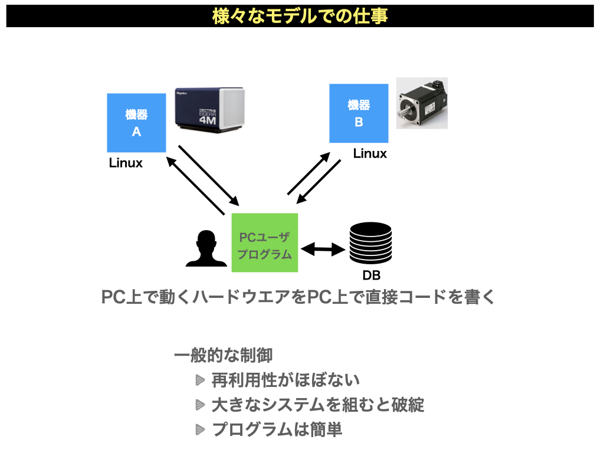
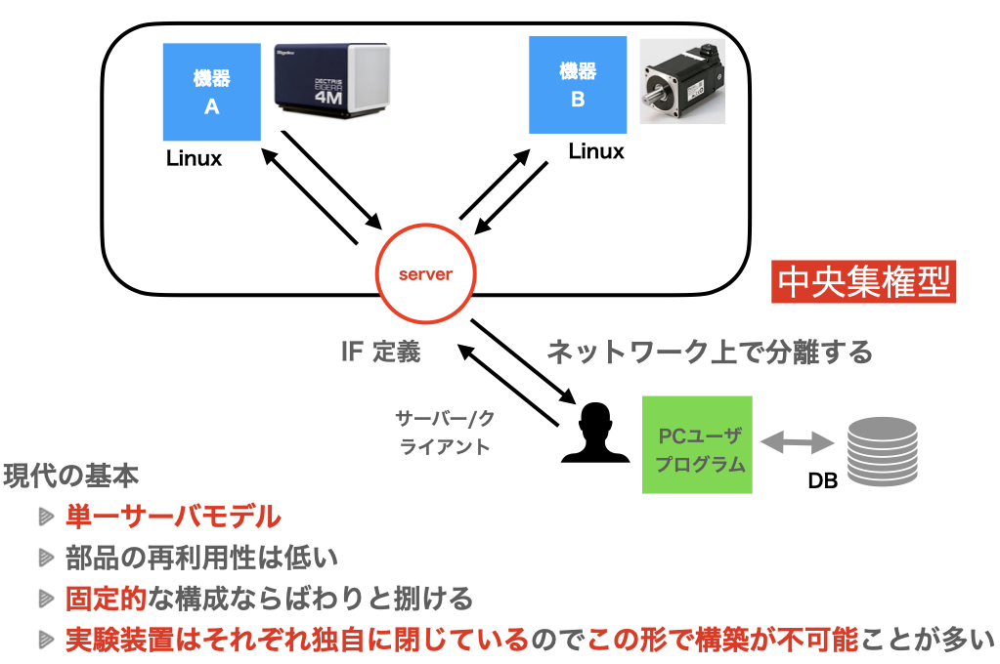
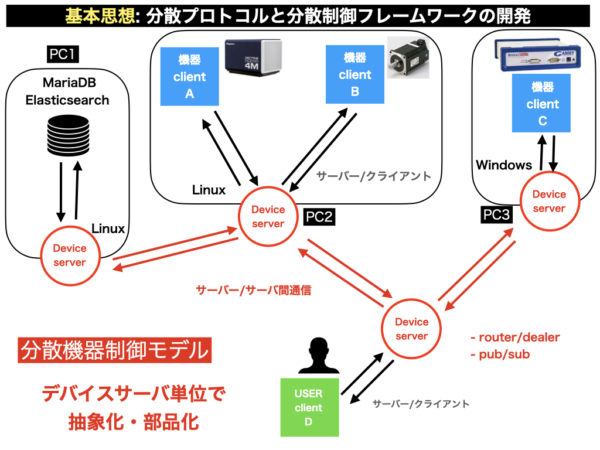
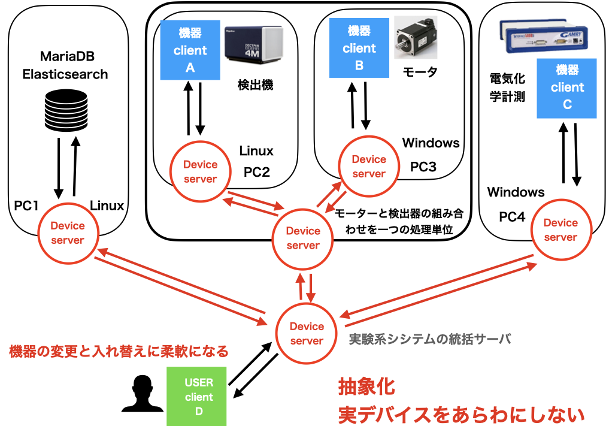
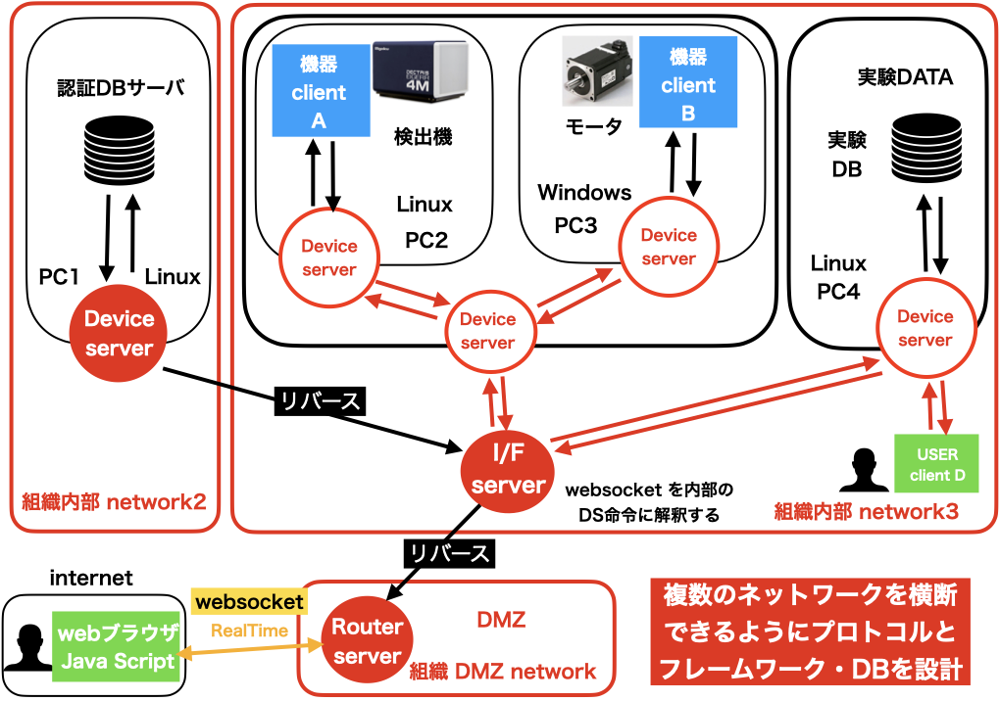
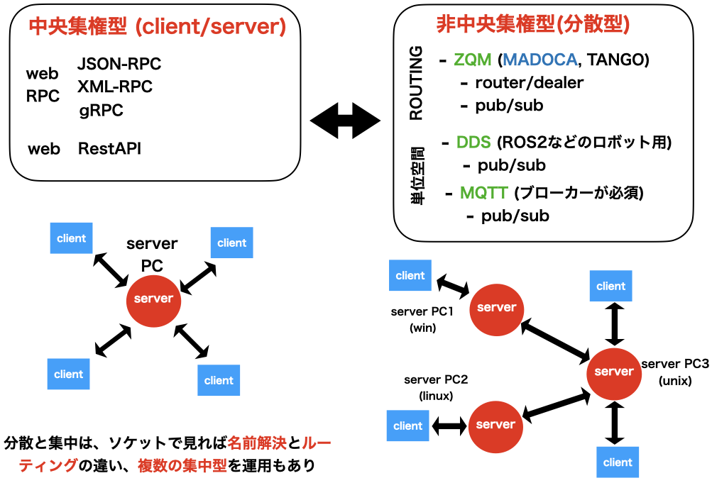
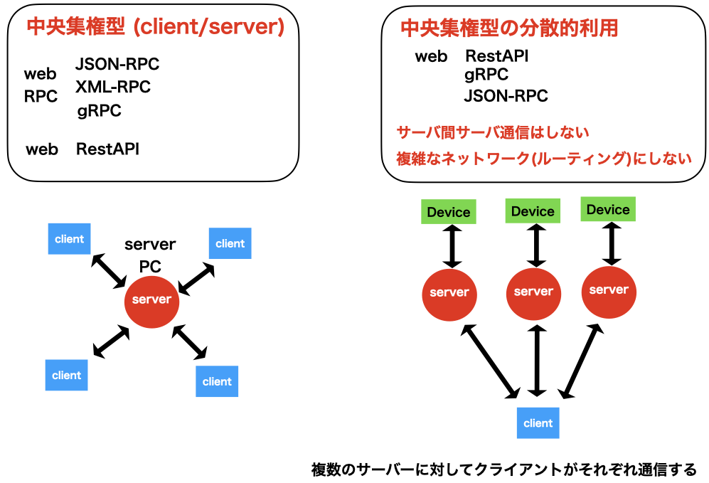
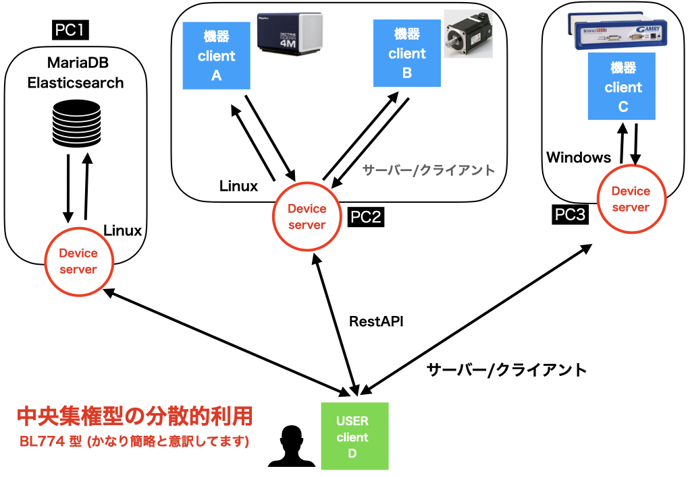
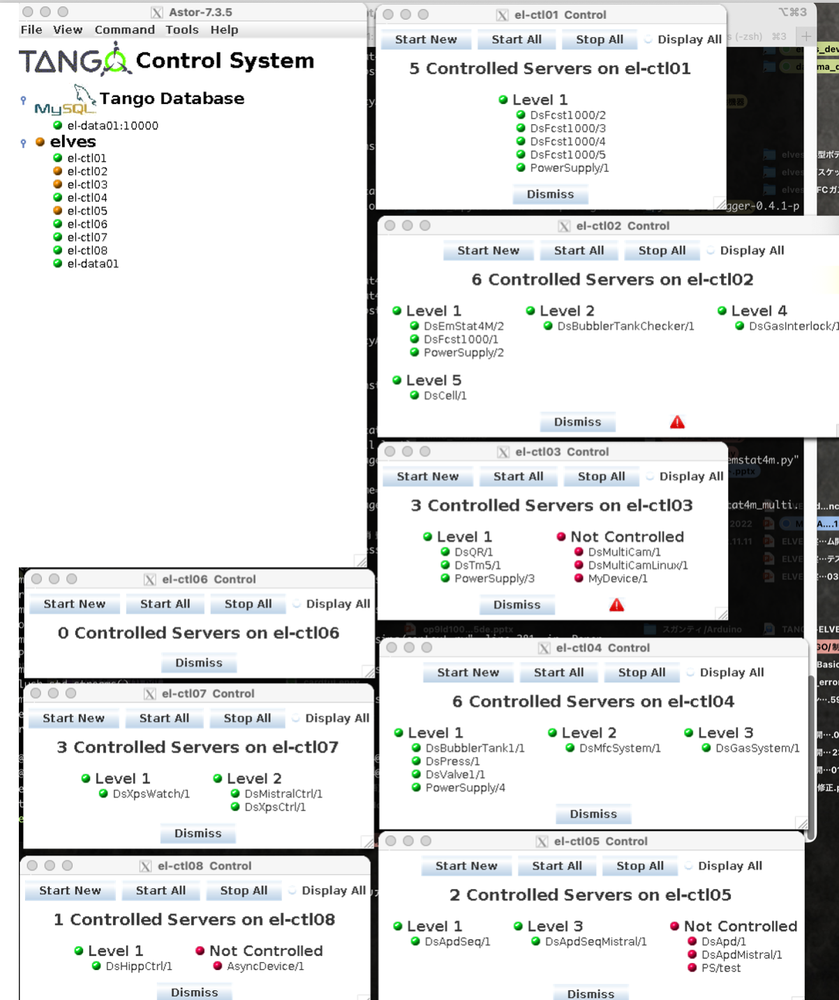
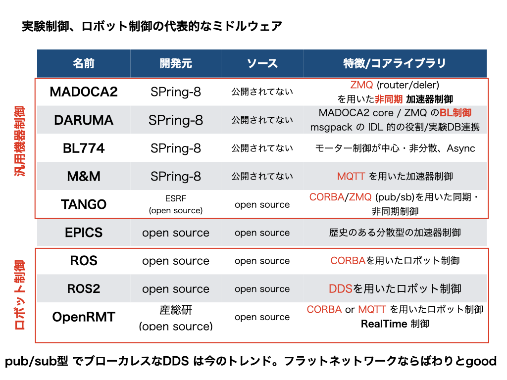

# 機器制御における分散モデル

制御の基本モデルには色々な考え方がある。
状況によってはそれぞれ一長一短があるので後述するモデルがより優れているわけではない。
適切なモデルを選択し、機器を制御するプログラムを構築する必要がある。
これらは模式的なものであり、実際のモデルとは詳細では異なる場合があるので注意してほしい。

筆者は情報や制御の専門ではないのでいい加減な用語の使い方がしてあるとは思う。
サーバー・サーバーとかサーバー・クライアントとかソケット間通信のモデル分類から見れば
アホな用語ではあるのはわかっているが素人的にはわかりやすい。

## 分散制御モデルの代表的な模式図

下記の図は、一番よくある現場での開発例である。
ある制御専用の**PC**上で検出機(機器A)が動き、また同時にステージ類を動かすハードウエア(機器B)が
**PC**繋がっている。この場合は、その**PC**上で制御プログラムを動かせば、**機器A**と**機器B**を操作することができる。
一見するとこれで全てが終わりに見えるが、

- 機器A と機器B で要求される OS が linux と windows と異なる場合、一つのPC上での共存は不可能になる。
- PCにすべての機器を制御する負荷がかかる点
- PCに繋ぐデバイス数の上限(IOの上限)、
- PCから物理的に機器Aと機器Bが離れていると、電気的に困難が多い
- すべての機器制御プログラムが単一のプログラムであるために、 最初から見通しよく設計しないと破綻しやすい
- 機器の更新や付け替えの際にプログラムの修正が大きくなる点、
 
現実の状況下では、このシンプルなモデルはテスト例以外では
使えないことが多い。

<!--  -->

### 中央集権型での機器制御

実際には中央集権型の多くは後述する「複数の中央集権型」のあつまり
として扱うことが多い。そのため模式的なモデル以上の意味はないかもしれないが、
**中央集権型 <-> 分散型**
というモデルの違いは理解おいた方が、制御としては健全である。

<!--  -->

### 本格的な分散モデルでの機器制御

[MADOCA/DARUMA](https://user.spring8.or.jp/sp8info/?p=37181) や
[TANGO](https://www.tango-controls.org/) のような本格的な分散
モデルではZMQ/CORBAにより本格的な分散モデルが構築されている。

これによりサーバー・サーバー間通信により各ノード間がつなり、
ユーザーは一つのノードの対してアクセスするだけで、
関連するノードを操作が可能になる。
詳しくは割愛するが、MADOCAはデバイスごとのサーバという単位より、
さらに粒度が細かい単位でメッセージサーバーを配置できるために、
より複雑なネットワークとデバイスの接続を維持できる。
無論ビームラインで単位で個別の実験単位で見れば過剰な仕様であるとも言えなくもない。

ともあれ、それぞれのデバイスサーバーに対して、デバイスプロキシなどで
透過型でアクセスする限りは、ユーザーサイドから見れば
ただの単一の python プログラムであるのでそれほど意識することはない。

<!--  -->

### 現実的なケース (本格的な分散モデルの場合)

サーバー・サーバー間通信を積極的に活用する。
この一般的な分散システムにおいては

- 機器ごとに小さい単位でサーバー化する(デバイスサーバー化)
- ある程度の装置の組み合わせ単位（機能的に連携する単位で）で一つのデバイスサーバー内で閉じる。
責務での分離という以上に、
この場合は通信それ自体がそのサーバー内での複数のサーバークライアント通信で閉じる。
つまり高速になるメリットがある。
- デバイスの抽象度を上げる

などのような構成が容易に可能になる。
ある意味一般的なクララスライブラリの構成をサーバー単位で拡張した概念で組むことが可能になる。
これをMADOCAのような本格的な分散プロトコルでは単独でこのようなモデルが構築できる。

<!--  -->

### 複数のネットワークセグメントまたがる場合

全てにネットワークに統一的な通信プロトコルを使い、
ルーティングをする意義があるかはともかく、
プロジェクトによってはネットワークセグメントを跨ぐ場合がある。

つまり、複数のネットワークセグメントを横断する形で制御系システムを構築する必要がある。

TANGO の場合は分散プロトコルでは同じだが、メッセージサーバーがデバイスサーバーがたと一体となっている思想であるために、
粒度のコントロールがよりおおきく、ネットワークセグメントを超えたルーティングにはプロトコルとしては
対応してない。 MADOCAほど統一的なプロトコルで制御する設計ではない。（その必要性の有無はともかく）
結局プロトコル側とフレームワーク側に責務を押し付けて、より巨大なシステムと小さいステムを一次元的に管理運用する方針なのか？
プロトコルとフレームワークの役割をできる限りコンパクトにして、運用のシステム側でカバーするのか？の違い集約するとも言える。

<!--  -->

### 中央集権型と分散型
これまでの話をおおさっぱにまとめる

### 中央集権型の分散利用

### 中央集権型を複数用意する

[BL774](https://user.spring8.or.jp/sp8info/?p=42759)などでは、
本格的な分散プロトコルは用いない。コンパクトなネットワークの中で、
実験機器を操作することに徹している。
そのめサーバーサーバー間通信をプロトコルとして捨てる。
デバイスサーバー自体の機能からサーバー・サーバー間通信を捨て、
個別にクライアントと通信する形にする。
つまりプロトコルとしてみれば、本質は中央集権型である。

この場合必要なデバイスサーバー(ノード)をユーザーはそれぞれ接続して
接続する必要がある。それぞれに通信が発生する。
それぞれがほぼ完全独立であり、非常にシンプルだが。
デバイスサーバーなどの単位で分離している。

それぞれのデバイスサーバーを透過型で使うことができれば、
ユーザー側のpython プログラムから、特に何かを意識することなる。
個別のpythonのクラスをそのまま使うだけでする。

<!--  -->

## マネージメント

分散制御系にとって、デバイスサーバーのマネージメントなどは、デバイスの数が増えてくると必須となる。
スサノオではまだ用意してない。将来的にも用意しないかもしれない。

TANGO などでは　デバイスサーバーを起動するためのスターターデバイスサーバーがあり、
デバイスサーバーの名前解決やオブジェクト情報のまめのTANGOネットワークの基本となるデーターベースらも、
デバイスサーバーとして起動する。つまり、スターターデバイスサーバによって順に立ち上げてマネージメントする仕組みがある。
ある意味思想的に一貫して、徹底しておりとても美しく気持ちよかった。まぁ、運用面など含めて中身はごったに感はあったが。
起動レベルの制御がマネージメントツールで一元化できるのは実験現場的には便利ではあった。

無論、TANGO において、これらのマネージメント機能を使わずに、個別のデバイスサーバーを好きに立ち上げて接続すれば機能する。
小さいネットワークではマネージメント経由でデバイスサーバーを立ち上げなければ良い。

MADOCA は TANGO でいうところのスターターデバイスサーバーが存在しない。MADOCA は巨大で複雑なネットワーク環境で動くことが
前提であるために、統一的にデバイスサーバーでデバイスサーバーを管理するという発想が薄かった。
無論、メッセージサーバーやEM(デバイスサーバのようなもの)のコントールはできたが、TANGO でいうところのスターターデバイスサーバは
存在しなかった。 肝心要のメッセージサーバー自体をブートする仕組みがない。EMの停止はできるが、たしかスタートができない。
コントロールできても、それは問い合わせた時だけ機能する仕組みだ。
そうでないと、マネージメントの通信量が尋常ではなくなる。
巨大な実験システムを一元的にネットワーク分散管理するシステムが前提の元だといろいろと制限が多くなる。
あまり覚えてないがデバイスサーバーでデバイスサーバーを起動するという考えは合わないという結論だった。
そして、プロセスを立ち上げるためのプロセスを作って意味があるか？という議論に落ち着く。
それをいえば TANGO もスターターデバイスサーバーそれ自体は誰かがブートしないといけないので、
結局は systemd にさせている。
どちらにせよ、わざわざデバイスサーバーをマネージする仕組みを作るならば、
既存のプロセス管理の仕組み、つまり、systemd や windowsサービスを使えば良いに落ち着いた。
もしくは簡単な起動ランチャー(Madoca launcher) である。Aster もその意味では TANGO DEVICE Server 起動ランチャーではある。

## 実験系分散システムにおけるプロトコルのトレンド

TANGOやMADOCAやBL774という言葉は、プロトコルを示す以上にフレームワークを示す言葉である。
lowレベルのプロトコルで言えば、TANGOやMADOCAは ZMQ であり、BL774 は RestAPI である。これらをまとめる。
少し調査と情報が古いうえに偏っているところもあるが、大型放射光施設をめぐるプロトコルとフレームワーク事情をまとめられたらと思う。
あとロボット。

たとえば、ESRF の [TANGO](https://www.tango-controls.org/)
は TANGO v10 からメッセージ通信においても、CORBA の同期通信から ZMQ の非同期に変わるなど古いプロトコル(CORBA)を捨てる動きが本格化している。

欧州でロボットで使われることの多い ROS は ROS1 系は CORBA であったが、ROS2系かからDDS基盤への完全に移行している。
デンソーウェーブのORiN2は ROS1 への接続へは拡張はできるが、ROS2は完全に非対応なので、
もはや過去の遺物とかしている。

---
# 作者
- Kengo NAKADA (中田謙吾)
  - kengo.nakada@mat.shimane-u.ac.jp
  - kengo.nakada@gmail.com