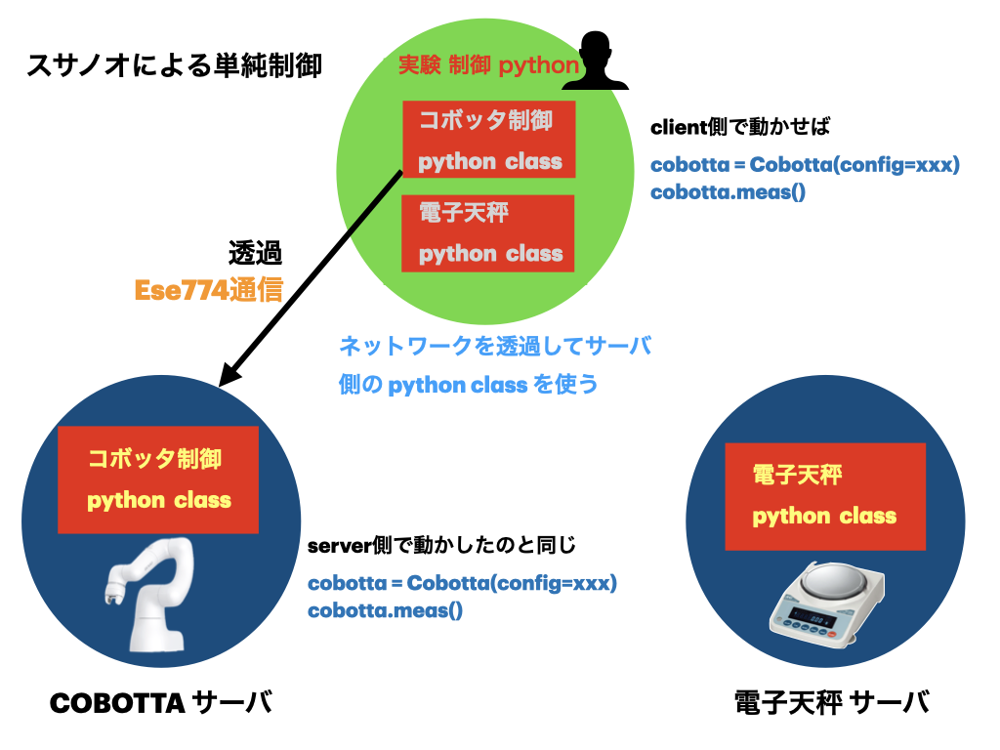

# スサノオのシステム

スサノオの根底はシンプルな透過型で構成されている。
これはサーバー側の制御classをそのままクライアント側の制御class
として使うことができる。クライアントで

```python
cobotta = Cobotta(config=xxx)
cobotta.meas()
```

のように動かせば。それはサーバー側

```python
cobotta = Cobotta(config=xxx)
cobotta.meas()
```

として動かしたことと同じになる。
図ではクライアント側（ユーザ側）とサーバ側（機器側）で同じく機器制御クラスが書いてあるが、
機器制御クラスの実態はサーバー側にある。それを透過してクライアント側でそのまま使えるのが
透過型である。


<!--  -->

無論、たとえば測定したデータを「保存」する場合は、
クライアント側ではクライアント側に保存されることが期待される。
    
しかし、完全に透過型のままだと、保存すればデータはサーバ側に保存されてしまう。
そもそも実態としてデバイスクラスが動作しているのはサーバ側であるからだだ。
あくまでクライアントで記述したpythonで動いているよう見えるだけで、
本当に動作しているのはサー側だからだ。
これはクライアント側のクラスで、デバイスプロキシ側で元の ese774_frame によって
動的にクライアント上に作られたクラスを継承して、オーバーライトする必要がある。
このような特定のメソッドに対して動作を変えるための仕組みを持つ必要がある。

ese774_frameでは、まず、透過する API側を事前に定義する。I/F定義である。
これには pydantic を用いてる。そために、自動で OpenAPI対応となる。
ese774 では自動ディスパッチで制御からのクラスが透過するので、正直 pytantic
での I/F 定義はあまり意味がないが、スサノオが用意する client ではなくて、
pydantic I/F (OpenAPI) に対応するソフトであればどのようなクラアントプログラムに対応している
のが味噌になる。
ただし、通常は ese774 でつかわれてるのは制御からのctrlをそおまま透過したclass
なのであまり意味はない。どちらかといと pydantic I/F 定義により、必要な API のみを透過できる。
API 選別を行う形になる I/F である

これにたいして、grpc_frame では pydantic がないために、わざわざ I/F 定義を作らない。
元の制御クラスのメソッドを全て透過する。セキュリティ上問題があるが。ラボ内での実験制御向けなので
複雑なことはしてない。

以下のセクションでもう少し詳細を説明する

## ese774 frame の基本

スサノオシステムを中核をなすのが ese774_frame (および grpc_frame) である。
ここでは ese774 frame に基本的な仕様について説明する

- [チュートリアル](https://ohara-lab-su.github.io/ese774_frame/)

```text
Python ctrl (純粋)
  ↓
Server: FastAPI + Pydantic (入力検証とJSON化のみ)
  ↓ (JSON)
Client: Pydanticで復元
  ↓
Python (素の値だけ返す)
```

---
# 作者
- Kengo NAKADA (中田謙吾)
  - kengo.nakada@mat.shimane-u.ac.jp
  - kengo.nakada@gmail.com